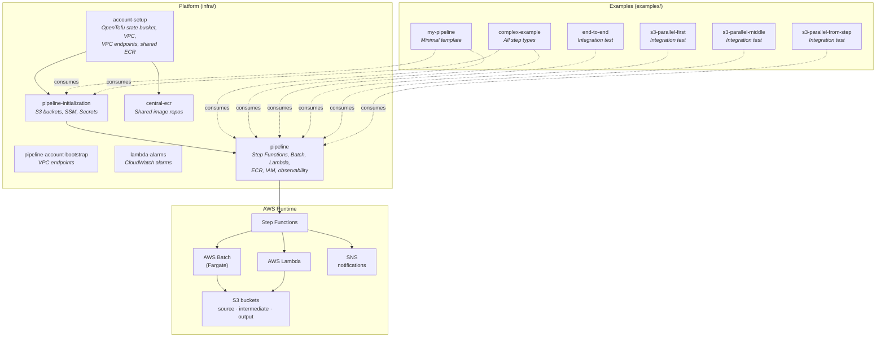

<!-- Copyright Amazon.com, Inc. or its affiliates. All Rights Reserved. SPDX-License-Identifier: MIT-0 -->

# sample-pipeline-generator

Easily deployable, YAML-driven data processing pipelines on AWS. Every pipeline is declared in a single `pipeline.yaml` and materialized as a Step Functions state machine that orchestrates AWS Batch (Fargate / Fargate Spot), AWS Lambda, S3 data flow, parallel fan-out, structured logging, and distributed tracing — no orchestration code required.

The repository ships as an [AWS sample](https://github.com/aws-samples): a set of reusable OpenTofu modules plus fully deployable example pipelines that consume them by relative path. Clone, `make all`, deploy an example, run it.

---

## Table of contents

- [Architecture](#architecture)
- [Repository layout](#repository-layout)
- [Requirements](#requirements)
- [Quickstart](#quickstart)
- [Quality gates](#quality-gates)
- [Extend and customize](#extend-and-customize)
- [Destroy](#destroy)
- [Documentation index](#documentation-index)
- [Known issues and troubleshooting](#known-issues-and-troubleshooting)
- [Security](#security)
- [License](#license)

---

## Architecture

The platform is two-layered: a reusable set of OpenTofu modules under `infra/modules/`, and self-contained example pipelines under `examples/` that consume them via relative paths.



For the step-level orchestration diagram (Step Functions template, parallel-block initialization, copy-to-output), see [`infra/modules/pipeline/README.md`](infra/modules/pipeline/README.md#architecture).

---

## Repository layout

```
.
├── README.md                       (this file)
├── Makefile                        # Pipeline deploys + repo-wide quality gates
├── TROUBLESHOOTING.md              # Known issues & workarounds
├── .pre-commit-config.yaml
├── .terraform-docs.yml
├── .checkov.yaml
├── code/
│   └── shared/
│       └── copy-intermediate-to-output/  # Shared Batch image
├── infra/
│   ├── deployments/
│   │   ├── Makefile                # Account bootstrap + shared image lifecycle
│   │   └── account-setup/          # State bucket, VPC, VPC endpoints, shared ECR
│   └── modules/                    # Reusable OpenTofu modules
│       ├── pipeline/               # Core orchestration module
│       ├── pipeline-initialization/# S3, SSM, Secrets Manager
│       ├── pipeline-account-bootstrap/  # Optional VPC endpoints
│       ├── central-ecr/            # Shared ECR repositories
│       └── lambda-alarms/          # CloudWatch alarms for Lambda
├── examples/
│   ├── scaffold.py                 # Pipeline & step scaffolder
│   ├── my-pipeline/                # Minimal template to copy
│   ├── complex-example/            # Full-featured showcase
│   ├── end-to-end/                 # Integration test pipeline
│   ├── s3-parallel-first/          # Integration test pipeline
│   ├── s3-parallel-middle/         # Integration test pipeline
│   └── s3-parallel-from-step/      # Integration test pipeline
└── tests/
    └── integration/                # End-to-end pytest suite
```

Two Makefiles drive the repository — the top-level [`Makefile`](Makefile) for pipeline deployments and the repository-wide quality gates, and `infra/deployments/Makefile` for account bootstrap and the shared image.

---

## Requirements

### Tooling

| Tool | Version | Purpose |
|------|---------|---------|
| [OpenTofu](https://opentofu.org/) | `>= 1.8` | Terraform-compatible IaC (all modules pin `terraform { required_version >= 1.8 }`) |
| AWS CLI | `>= 2.0` | Auth, S3 bucket bootstrap, ECR login |
| Python | `3.13` | Step code (each step's `pyproject.toml` pins `>=3.13,<3.14`, matching the `python:3.13-slim` build image and `python3.13` Lambda runtime) |
| Poetry | `>= 1.7` | Python dependency management for step code |
| Container runtime | any of `docker`, `finch`, `podman` | Image builds; select with `CONTAINER_RUNTIME=<tool>` |
| [`terraform-docs`](https://terraform-docs.io/) | latest | Auto-injects the input/output table into each module README (pre-commit hook) |
| [`tflint`](https://github.com/terraform-linters/tflint) | latest | Static analysis for OpenTofu code (pre-commit hook) |
| [`pre-commit`](https://pre-commit.com/) | latest | Git hooks for local quality checks |
| [`check-jsonschema`](https://check-jsonschema.readthedocs.io/) | latest | Validates every `pipeline.yaml` against `pipeline.schema.json` |
| [`checkov`](https://www.checkov.io/) | latest | Security scan on OpenTofu plans (invoked by `make checkov-check`) |

### AWS

- An AWS account you can deploy against (dev). The `account-setup` deployment expects admin-equivalent permissions on first apply.
- A region that supports Fargate, Batch, and every VPC endpoint you enable (`s3`, `ecr`, `cloudwatch`, `ssm`, `secretsmanager` by default).

### Install the local hooks

```bash
pip install pre-commit==4.0.1 check-jsonschema==0.30.0  # or pipx / brew
pre-commit install
pre-commit install --hook-type commit-msg
```

If a global `~/.gitconfig` conflicts, use `GIT_CONFIG_GLOBAL=/dev/null GIT_CONFIG_SYSTEM=/dev/null pre-commit install` — see [TROUBLESHOOTING.md](TROUBLESHOOTING.md#pre-commit-install-conflicts-with-an-existing-global-hook).

The hooks enforce:

| Category | Hooks |
|----------|-------|
| Git hygiene | `check-added-large-files`, `check-merge-conflict`, `check-vcs-permalinks`, `forbid-new-submodules` |
| Formatting | `trailing-whitespace`, `end-of-file-fixer`, `mixed-line-ending`, `check-yaml` |
| Secrets | `detect-aws-credentials`, `detect-private-key` |
| OpenTofu | `tofu fmt`, `tofu validate`, `terraform-docs`, `tflint` |
| Python | `ruff` (lint + format), `bandit` |
| Pipeline schema | `check-jsonschema` on every `pipeline.yaml` |
| Commit messages | `gitlint` (Conventional Commits) |

---

## Quickstart

Clone the repository, then run the following in order.

Both Makefiles need `AWS_ACCOUNT_ID` and `AWS_REGION`. Export them, pass them on the
command line, or write them to a gitignored `.env` at the repository root:

```bash
cat > .env <<'EOF'
AWS_ACCOUNT_ID=<account_id>
AWS_REGION=<region>
EOF
```

`.env` only fills variables that are not already set, so an exported value or a
`make VAR=...` argument always wins — pointing a single run at another account never
requires editing the file.

### 1. Bootstrap the AWS account (once per account)

First create the deployment's `.tfvars` from the shipped templates — only the
`*.tfvars.example` files are committed (`*.tfvars` is gitignored):

```bash
cd infra/deployments/account-setup/env/dev
cp backend.tfvars.example backend.tfvars
cp inputs.tfvars.example  inputs.tfvars
$EDITOR backend.tfvars inputs.tfvars   # set region (required) and the <REGION>/<ACCOUNT_ID> placeholders
cd ../../..                            # back to infra/deployments/
```

A **fresh account** then needs the one-time two-pass bootstrap (the state bucket does
not exist yet), documented in [`account-setup/README.md`](infra/deployments/account-setup/README.md#first-time-bootstrap-fresh-account-state-bucket-does-not-exist). Once state lives in S3, `make all` is the steady-state path:

```bash
make all
```

`make all` runs `deploy-account-setup` (VPC, VPC endpoints, shared ECR via OpenTofu) and `deploy-shared` (builds and pushes the shared `copy-intermediate-to-output` image). See [`infra/deployments/README.md`](infra/deployments/README.md) for the complete target reference.

### 2. Configure environment variables for an example

```bash
cd ../../examples/my-pipeline/env/dev
cp backend.tfvars.example backend.tfvars
cp inputs.tfvars.example  inputs.tfvars
$EDITOR backend.tfvars inputs.tfvars   # fill in bucket, vpc_id, subnet_ids, ...
```

Values you need come from the `account-setup` outputs — run `tofu output` from inside `infra/deployments/account-setup/` after apply (works whether state is still local or already migrated to S3), or read them from the console.

### 3. Deploy the example pipeline

```bash
make deploy DEPLOYMENT=my-pipeline
```

`deploy` chains `tofu-plan` → `checkov-check` → `tofu-apply` → `deploy-all-images` (builds every step image, pushes to ECR, writes the tag to SSM). All targets live in the top-level [`Makefile`](Makefile) — run `make help` for the full reference.

### 4. Run the pipeline

```bash
aws stepfunctions start-execution \
  --state-machine-arn "arn:aws:states:$AWS_REGION:$AWS_ACCOUNT_ID:stateMachine:my-pipeline-dev" \
  --input '{"inputs": {"root_prefix": "input/simulation-data"}}'
```

Watch the execution in the Step Functions console. Logs are aggregated with `pipeline_name` / `step_name` / `run_id` in CloudWatch — pre-provisioned saved queries live under `Pipelines/<pipeline>/<env>/` (see [`infra/modules/pipeline/README.md`](infra/modules/pipeline/README.md#structured-logging--log-aggregation)).

---

## Quality gates

Repository-wide checks, all run from the root via the top-level [`Makefile`](Makefile). Each target provisions its own pinned virtualenv, so no global installs are needed.

| Target | What it does | AWS credentials |
|--------|--------------|-----------------|
| `make check-locks` | `poetry check --lock` for every committed `poetry.lock` | no |
| `make unit-tests-all` | pytest for every git-tracked example step | no |
| `make checkov-modules` | Checkov over `infra/modules/` and `infra/deployments/` | no |
| `make pre-commit-checks` | every pre-commit hook against all files | no |
| `make verify` | the four above, in order | no |
| `make checkov-examples` | plans each example, then Checkov-scans the plan JSON | yes |
| `make checkov-all` | `checkov-modules` + `checkov-examples` | yes |
| `make integration-tests` | the [`tests/integration`](tests/integration/README.md) suite against deployed pipelines | yes |

```bash
make verify              # pre-push gate; no AWS account needed
make integration-tests   # all four suites, ARNs derived from AWS_ACCOUNT_ID/AWS_REGION/ENVIRONMENT
```

`integration-tests` runs one suite per pipeline (`end-to-end`, `s3-parallel-first`, `s3-parallel-middle`, `s3-parallel-from-step`), deriving each state machine ARN as `<pipeline>-$(ENVIRONMENT)`. Scope it to one suite with `PIPELINE=`, and override the ARN with `SFN_ARN=` (which requires `PIPELINE=`):

```bash
make integration-tests PIPELINE=end-to-end
make integration-tests PIPELINE=end-to-end SFN_ARN=arn:aws:states:us-east-1:123456789012:stateMachine:end-to-end-dev
```

Each suite uploads test data, starts an execution, polls to completion, asserts the outputs, and cleans up — so it requires the pipeline to be deployed first.

---

## Extend and customize

To start a new use case, copy an example and edit its `pipeline.yaml`:

```bash
cd examples
./scaffold.py new-pipeline my-new-pipeline
```

`scaffold.py` copies `my-pipeline/`, renames it, updates the state key, and scaffolds `code/<step>/` directories for every step declared in `pipeline.yaml`. Run `./scaffold.py --help` for the full command list, or follow the manual walk-through in [`examples/README.md`](examples/README.md#step-by-step-guide).

The typical extension surface:

- **Add / remove steps** — edit `<pipeline>/pipeline.yaml` (`batch`, `lambda`, `parallel`). Schema reference: [`infra/modules/pipeline/schemas/README.md`](infra/modules/pipeline/schemas/README.md).
- **Change step code** — edit `examples/<pipeline>/code/<step>/main.py`, bump `version` in `pyproject.toml`, run `make deploy DEPLOYMENT=<pipeline>` from the repository root.
- **Change deployment target** — add `env/<env>/backend.tfvars` and `env/<env>/inputs.tfvars`, then `make tofu-apply DEPLOYMENT=<pipeline> ENVIRONMENT=<env>`.
- **Extra egress from Batch/Lambda** — set `sg_compute_additional` in `env/<env>/inputs.tfvars`. See [`infra/modules/pipeline/README.md`](infra/modules/pipeline/README.md#compute-security-groups-sg_compute_additional).

Rarely, you may need to modify the module code itself. When you do, the guardrails are: unit tests under `iac_tests/main.tftest.hcl`, Checkov clean, and the module's README regenerated by `terraform-docs`.

---

## Destroy

Order matters — teardown is the reverse of deploy.

```bash
# 1. Destroy each pipeline (ECR must be empty; set ecr_force_delete = true in inputs.tfvars for dev)
make tofu-destroy DEPLOYMENT=my-pipeline

# 2. Destroy shared account-level resources (VPC, shared ECR)
cd ../infra/deployments
make tofu-destroy DEPLOYMENT=account-setup

# 3. The OpenTofu state bucket is not managed by the module — delete manually if the account is being decommissioned
aws s3 rb s3://<state-bucket> --force
```

Bucket contents are not force-deleted by default. See [TROUBLESHOOTING.md](TROUBLESHOOTING.md#tofu-destroy-leaves-s3-buckets-behind) if `tofu destroy` complains about non-empty buckets or repositories.

---

## Documentation index

The root README is the driver. Each of the READMEs below covers one concern.

### Platform

| Path | Contents |
|------|----------|
| [`infra/README.md`](infra/README.md) | Modules and deployments summary, ADOT Lambda layer versioning |
| [`infra/deployments/README.md`](infra/deployments/README.md) | `infra/deployments/Makefile` reference, deployment order, variables |
| [`infra/deployments/account-setup/README.md`](infra/deployments/account-setup/README.md) | State bucket, VPC, VPC endpoints, shared ECR |
| [`infra/modules/pipeline/README.md`](infra/modules/pipeline/README.md) | Core orchestration module — inputs, outputs, step types, logging |
| [`infra/modules/pipeline/schemas/README.md`](infra/modules/pipeline/schemas/README.md) | Full `pipeline.yaml` schema (every field, every step type) |
| [`infra/modules/pipeline/step_functions/README.md`](infra/modules/pipeline/step_functions/README.md) | Runtime contract: environment variables, event payload, `MAP_ITEM`, `EXECUTION_INPUT` |
| [`infra/modules/pipeline/lambdas/README.md`](infra/modules/pipeline/lambdas/README.md) | Internal service Lambda (parallel-block initialization) |
| [`infra/modules/pipeline-initialization/README.md`](infra/modules/pipeline-initialization/README.md) | S3 buckets, SSM parameters, Secrets Manager secrets |
| [`infra/modules/pipeline-account-bootstrap/README.md`](infra/modules/pipeline-account-bootstrap/README.md) | Optional VPC endpoints |
| [`infra/modules/central-ecr/README.md`](infra/modules/central-ecr/README.md) | Shared ECR repositories with cross-account pull |
| [`infra/modules/lambda-alarms/README.md`](infra/modules/lambda-alarms/README.md) | CloudWatch alarms for Lambda |
| [`code/README.md`](code/README.md) | Step directory conventions, image versioning contract |
| [`code/shared/copy-intermediate-to-output/README.md`](code/shared/copy-intermediate-to-output/README.md) | Shared Batch job that copies intermediate → output |

### Examples

| Path | Contents |
|------|----------|
| [`examples/README.md`](examples/README.md) | Makefile reference, step-by-step new-pipeline guide, `scaffold.py` |
| [`examples/my-pipeline/README.md`](examples/my-pipeline/README.md) | Minimal template pipeline — copy this to start |
| [`examples/complex-example/README.md`](examples/complex-example/README.md) | Every feature in one pipeline (batch, lambda, parallel, SSM, secrets, copy-to-output) |
| [`examples/end-to-end/README.md`](examples/end-to-end/README.md) | Integration test pipeline — full feature exercise |
| [`examples/s3-parallel-first/README.md`](examples/s3-parallel-first/README.md) | Integration test — parallel block as first step (source-bucket discovery) |
| [`examples/s3-parallel-middle/README.md`](examples/s3-parallel-middle/README.md) | Integration test — implicit previous-step discovery |
| [`examples/s3-parallel-from-step/README.md`](examples/s3-parallel-from-step/README.md) | Integration test — explicit `from_step` discovery |

### Tests

| Path | Contents |
|------|----------|
| [`tests/integration/README.md`](tests/integration/README.md) | Pytest integration suite, per-pipeline test invocation |

### Agent guidance

[`AGENTS.md`](AGENTS.md) — repository conventions for AI agents.

---

## Known issues and troubleshooting

See [TROUBLESHOOTING.md](TROUBLESHOOTING.md) for the full list. Highlights:

- **First-time deploy fails on `NoSuchBucket`** — `account-setup` provisions its own state backend. On a fresh account, comment out `backend "s3" {}` in `account-setup/terraform.tf`, run `make deploy-account-setup`, then uncomment the line and re-run to migrate state into the newly-created bucket. See [account-setup/README.md](infra/deployments/account-setup/README.md#quick-start).
- **ECR push denied** — the caller's IAM identity needs `ecr:*` on the target repository.
- **`tofu destroy` fails on non-empty ECR** — set `ecr_force_delete = true` in dev.
- **`check-image-version` fails** — the ECR tag from `pyproject.toml` already exists; bump the `version` field before rebuilding.
- **`poetry.lock` regenerates on `make unit-tests`** — commit it, or run with `--no-update`.
- **Global pre-commit conflict** — bypass with `GIT_CONFIG_GLOBAL=/dev/null GIT_CONFIG_SYSTEM=/dev/null pre-commit install`.

---

## Security

See [CONTRIBUTING](CONTRIBUTING.md#security-issue-notifications) for information on reporting security issues.

Every module ships with:

- KMS-encrypted S3 buckets, SSM parameters, Secrets Manager secrets, and CloudWatch Logs.
- Public access blocks on every S3 bucket.
- Immutable ECR tags (with a `latest` exception) and cross-account KMS-scoped pull policies.
- Least-privilege IAM policies scoped by pipeline name, environment, and (where applicable) `Owner` tag.
- VPC flow logs on account-setup managed VPCs.

Checkov runs against every plan (`make checkov-check`). Suppressions are inline (`checkov:skip=<CHECK_ID>: <justification>`) and reviewable — do not disable Checkov globally.

## License

This library is licensed under the MIT-0 License. See the [LICENSE](LICENSE) file.
