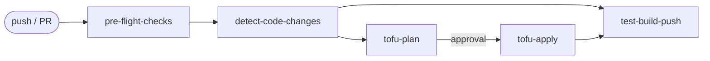

<!-- Copyright Amazon.com, Inc. or its affiliates. All Rights Reserved. SPDX-License-Identifier: MIT-0 -->

# Workflow Generator Examples

Example pipelines that show how to deploy data-processing workflows on AWS using the platform modules in this repository. Each example pipeline is a self-contained directory with its own infrastructure (OpenTofu), step code (Python + Docker), per-environment configuration, and a `pipeline.yaml` that declares the Step Functions topology.

Start your own project by **copying one of these example directories** (or this whole `examples/` folder) and editing YAML — orchestration, compute, storage, fan-out, and observability are provided by the platform modules under [`../infra/modules/`](../infra/modules). No orchestration code is required. The examples reference those modules via **relative paths**, so they work directly from a clone of this repository.

> Paths in this guide are written relative to the `examples/` directory (where [`scaffold.py`](scaffold.py) lives). Run `./scaffold.py` from here and `make` from the repository root.

## Table of contents

- [How these examples relate to the platform](#how-these-examples-relate-to-the-platform)
- [Example pipelines](#example-pipelines)
- [Step-by-step guide](#step-by-step-guide)
  - [Step 1 — Get a working copy](#step-1--get-a-working-copy)
  - [Step 2 — Define a new pipeline](#step-2--define-a-new-pipeline)
  - [Step 3 — Define the step code](#step-3--define-the-step-code)
  - [Step 4 — Deploy the pipeline](#step-4--deploy-the-pipeline)
  - [Step 5 — Run the pipeline](#step-5--run-the-pipeline)
  - [Step 6 — Extend the OpenTofu (only when needed)](#step-6--extend-the-opentofu-only-when-needed)
- [Scaffolding with scaffold.py](#scaffolding-with-scaffoldpy)
- [Repository structure](#repository-structure)
- [Environment configuration reference](#environment-configuration-reference)
  - [backend.tfvars — OpenTofu state location](#backendtfvars--opentofu-state-location)
  - [inputs.tfvars — Pipeline deployment variables](#inputstfvars--pipeline-deployment-variables)
  - [Adding a new environment](#adding-a-new-environment)
- [Prerequisites](#prerequisites)
- [Local development](#local-development)
  - [Infrastructure](#infrastructure)
  - [Code](#code)
- [CI/CD](#cicd)
- [Pre-commit hooks](#pre-commit-hooks)
- [Reference](#reference)

## How these examples relate to the platform

```
../infra/modules/    →  OpenTofu modules (the platform)
   (pipeline-initialization, pipeline, lambda-alarms)   ↑ referenced via relative source paths
examples/<pipeline>/ →  example pipeline deployments that consume them
```

Each example consumes the platform modules — `pipeline-initialization`, `pipeline`, and `lambda-alarms` — by **relative path** (e.g. `../../../infra/modules/pipeline`). You do not modify the platform here; you declare pipelines that use it.

- **Platform docs:**
  - [Platform README](../README.md) · [Documentation index](../DOCUMENTATION.md)
  - [`pipeline` module README](../infra/modules/pipeline/README.md) — every step type and field explained
  - [`pipeline.yaml` schema reference](../infra/modules/pipeline/schemas/README.md) — the authoritative field reference


**The documentation on the platform modules is extensive. Please check there for more information.**

## Example pipelines

Two ready-to-study pipelines ship here. Each has its own README with an architecture diagram.

| Pipeline | What it demonstrates |
|----------|----------------------|
| [`my-pipeline`](my-pipeline/README.md) | **The template to copy.** Minimal, deployable pipeline: `batch` → `parallel`/`lambda`. |
| [`complex-example`](complex-example/README.md) | Full feature showcase: 6 steps combining ingest/validate, a custom fan-out, copy-to-output, SSM parameters and secrets. |

---

## Step-by-step guide

This is the end-to-end path from a clone of this repository to a deployed pipeline.

> **Prerequisites first.** Make sure your machine and AWS account meet the [Prerequisites](#prerequisites) below before starting Step 4 (deploy).

> **Tip:** Steps 2 and 3 can be automated with the [`scaffold.py`](#scaffolding-with-scaffoldpy) helper. The steps below explain what it does under the hood.

### Step 1 — Get a working copy

To start a new project:

1. Clone this repository (or your fork of it).
2. Work inside the `examples/` directory — copy one of the example pipelines as your starting point.
3. Install the commit hooks (run from the repository root, where `.pre-commit-config.yaml` lives):

   ```bash
   git clone <your-repo-url>
   cd <your-repo>
   pre-commit install
   pre-commit install --hook-type commit-msg
   ```

Your clone already contains the example pipelines and a working `my-pipeline/` template you will copy in Step 2.

### Step 2 — Define a new pipeline

You author a pipeline by **copying the `my-pipeline/` template** and editing its [`pipeline.yaml`](my-pipeline/pipeline.yaml) — the single source of truth for the pipeline's name, buckets, tags, and steps.

```bash
# 1. Copy the template (the directory name becomes the pipeline name)
cp -R my-pipeline my-new-pipeline

# 2. Rename the pipeline (must match the directory name; S3-safe lowercase/digits/hyphens)
sed -i '' 's/pipeline_name: my-pipeline/pipeline_name: my-new-pipeline/' my-new-pipeline/pipeline.yaml
sed -i '' 's/tf-my-pipeline.tfstate/tf-my-new-pipeline.tfstate/'        my-new-pipeline/env/dev/backend.tfvars

# 3. Edit the steps in my-new-pipeline/pipeline.yaml — add, remove, or reorder them.
```

> **Pipeline names are S3 prefixes.** The `<pipeline>` directory name (also `pipeline_name` in `pipeline.yaml`) derives S3 bucket names, so it MUST follow [S3 bucket naming rules](https://docs.aws.amazon.com/AmazonS3/latest/userguide/bucketnamingrules.html): lowercase letters, digits, and hyphens only. Underscores will fail `tofu apply` with `InvalidBucketName`.

> **Step names use underscores, not hyphens.** Each step `name` becomes an ECR repository, a Step Functions state, and a `code/<step>/` directory, so use lowercase letters, digits, and underscores only — **no hyphens** (e.g. `ingest_raw_data`, not `ingest-raw-data`). `scaffold.py` enforces this and rejects hyphenated step names.

Each entry under `steps:` is one of three types — `batch`, `lambda`, `parallel`:

```yaml
# my-new-pipeline/pipeline.yaml
pipeline_name: my-new-pipeline

buckets:
  - source
  - intermediate
  - output

steps:
  - name: my_batch_step
    type: batch
    ram_mb: 2048
    vcpu: 1
    image_tag: latest
    copy_to_target: false

  - name: my_lambda_step
    type: lambda
    lambda_timeout: 60
    lambda_memory_size: 512
```

The complete field reference (every type, default, and the parallel fan-out modes) lives in the template's own [README](my-pipeline/README.md#the-pipelineyaml-contract), the shared [`pipeline` module README](../infra/modules/pipeline/README.md), and the [schema reference](../infra/modules/pipeline/schemas/README.md). Each `pipeline.yaml` carries a `yaml-language-server` schema directive at the top, so editors validate step types and required fields against `pipeline.schema.json` as you type.

> **Please take a look at the reference and the default values for the fields. For example, the CloudWatch Logs retention period is 365 days by default. The compute environment is Fargate by default.**

### Step 3 — Define the step code

Every **compute** step (`batch` and `lambda`) needs a matching directory at `code/<step-name>/`. For each step in `pipeline.yaml`, ensure the directory exists and delete the ones you no longer need.

```bash
cd my-new-pipeline
mkdir -p code/<step-name>/tests
# Copy from a sibling step of the same type, then edit:
#   batch  → start from my-pipeline/code/simple_step  (has a Dockerfile)
#   lambda → start from my-pipeline/code/process_item (no Dockerfile)
```

Conventions (full details in the [template README](my-pipeline/README.md#step-code-conventions)):

- **Batch step:** `code/<step>/` contains `Dockerfile`, `main.py`, `pyproject.toml`, `tests/`. The module builds an ECR repo `<pipeline>-<env>-<step>` and runs the image on Fargate.
- **Lambda step:** `code/<step>/main.py` must export `handler(event, context)`. No Dockerfile — the module zips and deploys it.
- Steps are decoupled from Step Functions via **environment variables** (`PIPELINE_NAME`, `STEP_NAME`, `SFN_EXECUTION_ID`, `INTERMEDIATE_BUCKET`, `SOURCE_BUCKET`/`OUTPUT_BUCKET`, `STEP_<previous>`, `EXECUTION_INPUT`). Lambda steps receive the per-execution fields through the `event` payload.
- Use `aws_lambda_powertools.Logger` with the `pipeline_name` / `step_name` / `run_id` keys so logs aggregate across the pipeline.

Test a step locally before deploying:

```bash
make unit-tests DIR=my-new-pipeline/code/<step-name>
```

### Step 4 — Deploy the pipeline

All commands run from the repository root via the top-level [`Makefile`](../Makefile). Infra targets take `DEPLOYMENT=<pipeline>`; code targets take `DIR=<pipeline>/code/<step>`. Run `make help` for the full reference.

```bash
# 1. Plan and run the Checkov security scan on the infrastructure
make checkov-check DEPLOYMENT=my-new-pipeline

# 2. Apply (interactive)
make tofu-apply DEPLOYMENT=my-new-pipeline

# 3. Build & push each step image to ECR, then point the pipeline at the new tag
make push-image-local       DIR=my-new-pipeline/code/<step-name> IMAGE_TAG=1.0.0
make update-parameter-store DIR=my-new-pipeline/code/<step-name> IMAGE_TAG=1.0.0
```

For a single command that chains `tofu-plan` → `checkov-check` → `tofu-apply` → `deploy-all-images` (i.e. every step under `code/*/Dockerfile`), use:

```bash
make deploy DEPLOYMENT=my-new-pipeline
```

Set environment-specific values in `env/<env>/inputs.tfvars` (`region`, `vpc_id`, `subnet_ids`) and the state location in `env/<env>/backend.tfvars` before applying. Copy from the `.tfvars.example` files provided. Add `env/int/`, `env/prod/`, etc. to support more environments.

> This repository ships no CI/CD workflows. If you add them, pushing changes under `<pipeline>/infra/**` or `<pipeline>/code/**` can detect the pipeline, plan it, apply after approval, and build/push images. Until then, deploy with the Makefile targets above.

### Step 5 — Run the pipeline

Once deployed, start an execution from the AWS Console or the CLI:

```bash
aws stepfunctions start-execution \
  --state-machine-arn "arn:aws:states:<region>:<account>:stateMachine:<pipeline>-<env>" \
  --input 'YOUR_INPUT'
```

Or from the console: **Step Functions → State machines → `<pipeline>-<env>` → Start execution**.

The execution input is a JSON object passed to the first step. Its structure depends on your pipeline.

Steps receive this via the `EXECUTION_INPUT` environment variable (Batch) or the `event` payload (Lambda) and can extract custom fields as needed.

For the full execution input schema and the fields available to steps at runtime, refer to:

- [`pipeline.yaml` schema reference](../infra/modules/pipeline/schemas/README.md) — Custom and S3 discovery modes
- [Execution input documentation](../infra/modules/pipeline/step_functions/README.md#execution-input) — details on how input is propagated to steps, available environment variables, and inter-step data passing

You can also trigger pipelines automatically via S3 events, API calls, or schedules.

### Step 6 — Extend the OpenTofu (only when needed)

You rarely touch `<pipeline>/infra/` — it just decodes `pipeline.yaml` and instantiates the shared modules. Edit it only when you need to:

- **Add pipeline-specific resources** (e.g. an extra DynamoDB table, an SNS topic) — add them to `<pipeline>/infra/main.tf` alongside the existing module blocks, and surface anything useful in `outputs.tf`.
- **Pass new module inputs** — add a `variable` in `<pipeline>/infra/variables.tf`, wire it into the `module "pipeline"` block, and give it a value in `env/<env>/inputs.tfvars`.
- **Pick up platform module changes** — the examples reference the modules by relative path (e.g. `source = "../../../infra/modules/<module>"`), so changes to `../infra/modules/` are picked up directly. Review the [`pipeline` module README](../infra/modules/pipeline/README.md) inputs for breaking changes, then `make tofu-plan DEPLOYMENT=<pipeline>` and review the diff carefully. (If you instead consume the modules from a published Git tag, bump the `?ref=<version>` pin on each module `source`.)

After any OpenTofu edit, run `tofu fmt`, let the pre-commit hooks regenerate the module docs, and verify with `make tofu-plan DEPLOYMENT=<pipeline>`.

---

## Scaffolding with `scaffold.py`

`scaffold.py` (in `examples/`) automates the repetitive parts of the guide above — creating and renaming a pipeline (Step 2), and generating the step code directories (Step 3). It treats each `pipeline.yaml` as the **source of truth**: a `reconcile` command creates a `code/<step>/` directory for every `batch`/`lambda` step declared in the YAML (descending into `parallel` blocks) and reports any leftover directories.

Pre-commit hooks (Step 1.3) are not automated — run `pre-commit install` and `pre-commit install --hook-type commit-msg` directly.

> It does not replace the manual flow — it just does the copying, renaming, and `code/` wiring for you. You still author the steps in `pipeline.yaml` and write each step's logic.

Requires Python 3 with PyYAML (`pip install pyyaml==6.0.3`). Run all commands from `examples/`.

### Commands

| Command | Does | Guide step |
|---------|------|------------|
| `./scaffold.py new-pipeline <name>` | Copies `my-pipeline/` to `<name>/`, sets `pipeline_name`, updates the state key, then prompts you to define the steps and scaffolds their code. | 2 (+3) |
| `./scaffold.py new-step <pipeline> <step> <batch\|lambda>` | Scaffolds a single step from the matching template (`batch` keeps a Dockerfile, `lambda` does not). | 3 |
| `./scaffold.py reconcile <pipeline> [--prune]` | Syncs `code/` with `pipeline.yaml`: creates missing step dirs; lists orphan dirs. `--prune` removes orphans after a per-directory confirmation. | 3 |

### Typical flow

```bash
# Step 2 — create a pipeline; you'll be asked to edit pipeline.yaml, then
#          its steps are scaffolded automatically (Step 3)
./scaffold.py new-pipeline my-new-pipeline

# Step 3 — after editing pipeline.yaml later, re-sync the code directories
./scaffold.py reconcile my-new-pipeline

# Add a single step on its own
./scaffold.py new-step my-new-pipeline ingest_raw_data batch
```

`reconcile` only **creates** by default; it never deletes without `--prune`, and even then it asks before removing each directory and never touches `test-data/`. After scaffolding, edit each step's `main.py` (and `pyproject.toml` / `Dockerfile` for batch) and continue with [Step 4 — Deploy](#step-4--deploy-the-pipeline).

---

## Repository structure

```
examples/
├── <pipeline>/
│   ├── pipeline.yaml          # Single source of truth: name, buckets, tags, steps
│   ├── infra/                 # OpenTofu (rarely edited — reads pipeline.yaml)
│   │   ├── main.tf            #   module sources are relative: ../../../infra/modules/*
│   │   ├── variables.tf
│   │   ├── outputs.tf
│   │   └── terraform.tf
│   ├── env/
│   │   └── <environment>/
│   │       ├── backend.tfvars
│   │       └── inputs.tfvars
│   └── code/
│       └── <step>/
│           ├── main.py
│           ├── Dockerfile      # batch steps only
│           ├── pyproject.toml
│           ├── tests/
│           └── test-data/      # optional sample data
└── scaffold.py                 # Pipeline / step scaffolding helper
```

| Directory | Purpose | Reference |
|-----------|---------|-----------|
| `<pipeline>/` | Per-pipeline self-contained tree | [my-pipeline](my-pipeline/README.md) · [complex-example](complex-example/README.md) |
| `<pipeline>/pipeline.yaml` | Declarative pipeline definition (steps, buckets, tags) — drives OpenTofu | [my-pipeline pipeline.yaml](my-pipeline/pipeline.yaml) |
| `<pipeline>/infra/` | OpenTofu; uses the platform modules under `../infra/modules/` via relative paths | [Step 6](#step-6--extend-the-opentofu-only-when-needed) |
| `<pipeline>/code/<step>/` | Step source — Python app, Dockerfile (batch only), tests | [step README](my-pipeline/code/simple_step/README.md) |
| `<pipeline>/env/<env>/` | Per-environment OpenTofu vars (region, vpc, subnets) — gitignored, copy from `.tfvars.example` | — |

## Environment configuration reference

Each pipeline carries a `env/<environment>/` directory with two variable files that configure the deployment target. You create one subdirectory per environment (`dev`, `int`, `prod`, etc.).

### `backend.tfvars` — OpenTofu state location

Controls where OpenTofu stores its remote state.

| Variable | Required | Description | Example |
|----------|----------|-------------|---------|
| `bucket` | yes | S3 bucket holding the OpenTofu state file. Provisioned during account setup. | `"terraform-state-bucket-us-east-1-123456789012"` |
| `key` | yes | Object key for this pipeline's state file. Convention: `tf-<pipeline-name>.tfstate` | `"tf-my-pipeline.tfstate"` |
| `region` | yes | AWS region of the state bucket | `"us-east-1"` |
| `use_lockfile` | no | Enable the S3 native state locking. Recommended. | `true` |

Example (`my-pipeline/env/dev/backend.tfvars`):

```hcl
bucket       = "terraform-state-bucket-us-east-1-123456789012"
key          = "tf-my-pipeline.tfstate"
region       = "us-east-1"
use_lockfile = true
```

### `inputs.tfvars` — Pipeline deployment variables

All variables consumed by the pipeline's `infra/variables.tf`. These change per account/environment.

| Variable | Required | Default | Description |
|----------|----------|---------|-------------|
| `region` | yes | — | AWS region for all resources. |
| `environment` | no | `"dev"` | Environment identifier. Used as a suffix in resource names (`<pipeline>-<env>-<step>`). Common values: `dev`, `int`, `prod`. |
| `vpc_id` | yes | — | VPC where Fargate tasks and Lambdas are placed. Get from account-setup outputs. |
| `subnet_ids` | yes | — | List of private subnet IDs (with NAT gateway access) for compute placement. Minimum 2 for AZ redundancy. |
| `ecr_force_delete` | no | `false` | If `true`, allows `tofu destroy` to remove ECR repos that still hold images. Set to `true` only in dev. |
| `sg_compute_additional` | no | `[]` | Additional egress rules for compute security groups. |

Example (`my-pipeline/env/dev/inputs.tfvars`) — copy from `inputs.tfvars.example` and fill in real values:

```hcl
region           = "us-east-1"
vpc_id           = "vpc-0123456789abcdef0"
subnet_ids       = ["subnet-0123456789abcdef0", "subnet-0123456789abcdef1"]
ecr_force_delete = true
environment      = "dev"
```

Example with additional security group rules (extra outbound HTTPS to specific endpoints):

```hcl
sg_compute_additional = [
  {
    from_port   = 443
    to_port     = 443
    protocol    = "tcp"
    cidr_blocks = [
      "203.0.113.0/24", # example: corporate / on-prem endpoints reachable on 443
    ]
  },
]
```

### Adding a new environment

To support additional environments (`int`, `prod`), create the corresponding subdirectory:

```bash
mkdir -p my-pipeline/env/prod
```

Then populate `backend.tfvars` (different state key or bucket) and `inputs.tfvars` (production VPC, subnets, `ecr_force_delete = false`). Deploy with:

```bash
make tofu-plan DEPLOYMENT=my-pipeline ENVIRONMENT=prod
```

## Prerequisites

- OpenTofu `>= 1.8` (repo constraint: `>= 1.8`)
- `terraform-docs`
- `tflint`
- Python `3.12`
- Docker
- Git Bash on Windows (`Git for Windows`)
- AWS CLI configured with appropriate credentials
- [pre-commit](https://pre-commit.com/) installed

### Setup

```bash
# Install pre-commit hooks
pre-commit install
pre-commit install --hook-type commit-msg
```

### Windows development

For Windows development, run OpenTofu-related pre-commit hooks from `Git Bash`, not from the WSL launcher at `C:\Windows\System32\bash.exe`.

Before running pre-commit, verify these commands resolve inside a clean Git Bash session:

```bash
which tofu
tofu version
which terraform-docs
terraform-docs --version
which tflint
tflint --version
```

For normal development, stage the files you want to commit and run pre-commit from the repository root in Git Bash:

```bash
python -m pre_commit run --all-files --config .pre-commit-config.yaml
```

If you are starting from PowerShell, call the Git for Windows Bash executable explicitly:

```powershell
& "$env:LOCALAPPDATA\Programs\Git\bin\bash.exe" --noprofile --norc -lc "cd '/c/path/to/<your-repo>'; python -m pre_commit run"
```

## Local development

All Make targets run from the repository root. There are two sets — code targets take `DIR=<pipeline>/code/<step>`, infra targets take `DEPLOYMENT=<pipeline>`.

### Infrastructure

```bash
# Plan only
make tofu-plan DEPLOYMENT=my-pipeline

# Plan + Checkov
make checkov-check DEPLOYMENT=my-pipeline

# Plan + Checkov + apply (interactive)
make tofu-apply DEPLOYMENT=my-pipeline
```

| Target | Description |
|--------|-------------|
| `tofu-init` | Initialize OpenTofu with `<pipeline>/env/<env>/backend.tfvars` |
| `tofu-plan` | Generate an execution plan |
| `checkov-check` | `tofu-plan` + Checkov security scan |
| `tofu-apply` | `checkov-check` + apply (interactive) |
| `tofu-destroy` | `tofu-init` + destroy (interactive) — teardown resources |

Variables: `DEPLOYMENT` (required), `ENVIRONMENT` (default: `dev`).

### Code

```bash
# Run unit tests for a step
make unit-tests DIR=my-pipeline/code/simple_step

# Build the Docker image
make build-image DIR=my-pipeline/code/simple_step IMAGE_TAG=1.0.0

# Build, authenticate to ECR, and push (also tags as :latest)
make push-image-local DIR=my-pipeline/code/simple_step IMAGE_TAG=1.0.0

# Verify a tag isn't already taken before bumping pyproject.toml
make check-image-version DIR=my-pipeline/code/simple_step IMAGE_TAG=1.0.0

# Update SSM so the deployed pipeline picks up the new tag
make update-parameter-store DIR=my-pipeline/code/simple_step IMAGE_TAG=1.0.0
```

| Target | Description |
|--------|-------------|
| `unit-tests` | Run pytest with coverage |
| `build-image` | Build Docker image; tags `:<IMAGE_TAG>` and `:latest` |
| `push-image` | Push existing image to ECR (CI/CD; assumes credentials) |
| `push-image-local` | `build-image` + ECR login + push |
| `check-image-version` | Fail if `IMAGE_TAG` already exists in ECR |
| `update-parameter-store` | Write `IMAGE_TAG` to `/pipelines/<pipeline>-<env>-<step>` |

Variables: `DIR` (required for code targets), `IMAGE_TAG` (default: read from the step's `pyproject.toml` version), `ECR_REGISTRY`, `AWS_REGION`, `ENVIRONMENT` (default: `dev`).

`DIR` accepts both `<pipeline>/<step>` and `<pipeline>/code/<step>` — the Makefile normalizes the form, so tab-completion against the actual `code/` path works.

### Build-tooling pins

The `setup` and `checkov-check` targets install Poetry and Checkov at pinned versions to keep CI reproducible and to defend against a compromised upstream release. Override via `POETRY_VERSION` and `CHECKOV_VERSION` when a bump is needed:

```bash
make setup POETRY_VERSION=1.8.3
make checkov-check DEPLOYMENT=my-pipeline CHECKOV_VERSION=3.2.256
```

## CI/CD

This repository ships no CI/CD workflows. If you add GitHub Actions, a workable design detects changes under `<pipeline>/infra/**` and `<pipeline>/code/**`, plans affected pipelines, applies after a review gate, and builds/pushes Docker images:



Until the workflows are added, run the equivalent steps locally with `make verify` (unit tests, Checkov on the modules, and every pre-commit hook) and the Makefile targets above. See [Quality gates](../README.md#quality-gates) for the full list, including `make integration-tests`.

## Pre-commit hooks

Configured in `.pre-commit-config.yaml`:

| Hook | Scope |
|------|-------|
| `terraform_fmt`, `terraform_validate`, `terraform_docs`, `terraform_tflint` | OpenTofu |
| `ruff` (lint + format) | Python |
| `bandit` | Python security |
| `gitlint` | Commit messages |
| `detect-aws-credentials`, `detect-private-key` | Security |

## Reference

- Pipeline guides: [my-pipeline](my-pipeline/README.md) · [complex-example](complex-example/README.md)
- Platform: [README](../README.md) · [docs index](../DOCUMENTATION.md) · [`pipeline` module](../infra/modules/pipeline/README.md) · [`pipeline.yaml` schema](../infra/modules/pipeline/schemas/README.md)
- Troubleshooting: [TROUBLESHOOTING.md](../TROUBLESHOOTING.md) — known issues and workarounds
