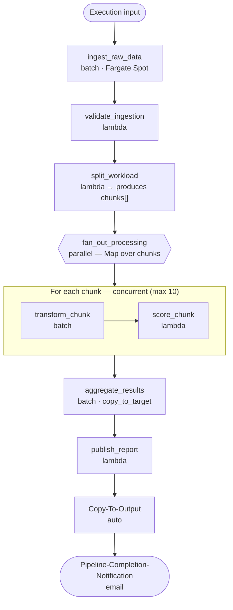

# complex-example

A full-featured reference pipeline that exercises **every step type** supported by the shared `pipeline` module — `batch`, `lambda`, and a `parallel` fan-out — plus runtime parameters, SSM parameters, Secrets Manager secrets, and automatic copy-to-output.

Use it as a worked example when you need to combine sequential processing and concurrent fan-out in a single workflow.

> The pipeline topology is declared entirely in [`pipeline.yaml`](pipeline.yaml). The OpenTofu under [`infra/`](infra/main.tf) only decodes that file and instantiates the shared modules — you rarely edit it. For the full field reference, see the shared [`pipeline` module README](../../infra/modules/pipeline/README.md) and the [`pipeline.yaml` schema reference](../../infra/modules/pipeline/schemas/README.md).

## What it does

The pipeline simulates an end-to-end data-processing workflow:

1. **Ingest** raw data and **validate** it before committing to expensive processing.
2. **Split** the validated workload into chunks and **fan out** over them concurrently, transforming and scoring each chunk.
3. **Aggregate** the per-chunk results and **publish** a report.
4. The aggregated output is automatically **copied to the `output` bucket**, and a **completion email** is sent.

## Architecture



`Copy-To-Output` and the completion notification are injected automatically by the module.

## Steps

| # | Step | Type | Highlights |
|---|------|------|------------|
| 1 | `ingest_raw_data` | `batch` | 4 GB / 2 vCPU container; `runtime_parameters` (`SOURCE_SYSTEM`, `INGESTION_MODE`). |
| 2 | `validate_ingestion` | `lambda` | 300 s timeout, 1 GB memory, 1 GB ephemeral storage; `VALIDATION_PROFILE`. |
| 3 | `split_workload` | `lambda` | Produces the `chunks` array consumed by the parallel block. |
| 4 | `fan_out_processing` | `parallel` | Fans out over `split_workload`'s `chunks` (`input.type: custom`, `from_step: split_workload`, `field: chunks`). Each iteration runs `transform_chunk` (batch) → `score_chunk` (lambda). |
| 5 | `aggregate_results` | `batch` | Combines per-chunk output; `copy_to_target: true` copies it to the `output` bucket. |
| 6 | `publish_report` | `lambda` | Final reporting step; `REPORT_FORMAT`, `DISTRIBUTION_LIST`. |

## Configuration

| Setting | Value |
|---------|-------|
| Buckets | `source`, `intermediate`, `output` |
| Capacity provider | `FARGATE_SPOT` (cost-optimized) |
| Max parallel concurrency | `10` |
| CloudWatch retention | `365` days |
| SSM parameters | `API_ENDPOINT`, `MODEL_VERSION`, `FEATURE_FLAGS` |
| Secrets | `DB_CONNECTION_STRING`, `EXTERNAL_API_KEY` |

SSM parameters and secrets are provisioned as empty placeholders by the `pipeline-initialization` module — set their real values out-of-band (see the shared module docs). Steps read them via the injected `SSM_PARAMS_PREFIX` / `SECRETS_PREFIX` environment variables.

## Layout

```
complex-example/
├── pipeline.yaml          # Topology (steps, buckets, tags, ssm, secrets)
├── infra/                 # OpenTofu — reads pipeline.yaml, calls shared modules
├── env/dev/               # backend.tfvars + inputs.tfvars (region, vpc, subnets, ...)
└── code/                  # One directory per compute step
    ├── ingest_raw_data/   # batch  (Dockerfile + main.py)
    ├── validate_ingestion/# lambda (main.py)
    ├── split_workload/    # lambda
    ├── transform_chunk/   # batch  (Dockerfile)
    ├── score_chunk/       # lambda
    ├── aggregate_results/ # batch  (Dockerfile)
    └── publish_report/    # lambda
```

## Deploy

Run all `make` targets from the repository root. See the [examples README](../README.md) for prerequisites and the full Makefile reference.

```bash
# 1. Plan + Checkov security scan
make checkov-check DEPLOYMENT=complex-example

# 2. Apply (interactive)
make tofu-apply DEPLOYMENT=complex-example

# 3. Build & push each batch/lambda step image, then point the pipeline at the new tag
make push-image-local      DIR=complex-example/code/ingest_raw_data IMAGE_TAG=1.0.0
make update-parameter-store DIR=complex-example/code/ingest_raw_data IMAGE_TAG=1.0.0
# (repeat per step)
```

Or, in a single command (infra + every step image):

```bash
make deploy DEPLOYMENT=complex-example
```

`deploy` chains `tofu-plan` → `checkov-check` → `tofu-apply` → `deploy-all-images` — the last target iterates every step under `code/*/Dockerfile` and calls `check-image-version` + `push-image-local` + `update-parameter-store` for each.

## Destroy

```bash
make tofu-destroy DEPLOYMENT=complex-example
```

For dev accounts, set `ecr_force_delete = true` in `env/dev/inputs.tfvars` before destroying so ECR repositories that still hold images can be dropped. Bucket contents are not force-emptied — see [TROUBLESHOOTING.md](../../TROUBLESHOOTING.md#tofu-destroy-leaves-s3-buckets-behind).

## Run it

1. Seed the `source` bucket with the sample data shipped with this example:

   ```bash
   aws s3 cp --recursive examples/complex-example/code/test-data/input/sensor-batch/ \
     s3://<source-bucket>/input/sensor-batch/
   ```

2. Start an execution of the `complex-example-<env>` state machine (Step Functions console) with an input such as:

   ```json
   { "inputs": { "root_prefix": "input/sensor-batch" } }
   ```

3. Inspect the copied output under `s3://<output-bucket>/<run-id>/aggregate_results/` and follow logs in CloudWatch (filter on the `pipeline_name`, `step_name`, `run_id` Powertools keys).

## Security notes

- **Do NOT log raw `STEP_*` or `EXECUTION_INPUT` at INFO.** These payloads are caller-supplied and may contain sensitive data. The lambda steps in this example (e.g. `score_chunk`) log only key presence at INFO and gate raw values behind `DEBUG` (`POWERTOOLS_LOG_LEVEL=DEBUG`). Preserve that pattern when copying step code into production. See <https://docs.powertools.aws.dev/lambda/python/latest/core/logger/>.

## Reference

- [Examples README](../README.md) — template workflow, prerequisites, CI/CD, Makefile
- [my-pipeline](../my-pipeline/README.md) — the minimal template to copy when starting a new pipeline
- [Shared `pipeline` module](../../infra/modules/pipeline/README.md) · [`pipeline.yaml` schema](../../infra/modules/pipeline/schemas/README.md)
