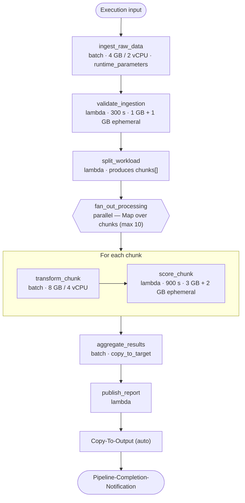

<!-- Copyright Amazon.com, Inc. or its affiliates. All Rights Reserved. SPDX-License-Identifier: MIT-0 -->

# end-to-end

Integration-test pipeline that exercises the **maximum feature surface** of the shared `pipeline` module in a single deployment. It is the reference used by the automated tests under `tests/integration/` and by developers who want to see every step type wired together.

Full pipeline definition: [`pipeline.yaml`](pipeline.yaml). The OpenTofu under [`infra/`](infra/main.tf) only decodes the YAML and calls the shared modules — see the [`pipeline` module README](../../infra/modules/pipeline/README.md) for the field reference.

## What it demonstrates

- Every step type (`batch`, `lambda`, `parallel`).
- Custom `parallel` fan-out driven by a previous lambda's output (`input.type: custom`, `from_step`, `field`).
- `batch` and `lambda` **runtime_parameters** injected as environment variables.
- Lambda customizations: extended timeout, memory, ephemeral storage.
- SSM parameters (`API_ENDPOINT`, `MODEL_VERSION`, `FEATURE_FLAGS`).
- Automatic copy-to-output (`copy_to_target: true` on `aggregate_results`).
- Pipeline completion notification.

## Architecture



`Copy-To-Output` and `Pipeline-Completion-Notification` are injected automatically by the module.

## Layout

```
end-to-end/
├── pipeline.yaml         # Topology, buckets (source/intermediate/output), SSM, secrets, tags
├── infra/                # OpenTofu — decodes pipeline.yaml, calls shared modules
├── env/dev/              # backend.tfvars.example + inputs.tfvars.example
└── code/                 # One dir per compute step
    ├── ingest_raw_data/  # batch (Dockerfile + main.py + pyproject.toml + tests)
    ├── validate_ingestion/
    ├── split_workload/
    ├── transform_chunk/  # batch (Dockerfile)
    ├── score_chunk/
    ├── aggregate_results/# batch (Dockerfile)
    ├── publish_report/
    └── test-data/        # Optional sample inputs
```

## Prerequisites

- Account bootstrap completed — `infra/deployments/account-setup` applied and the shared `copy-intermediate-to-output` image pushed (`cd infra/deployments && make all`).
- `env/dev/backend.tfvars` and `env/dev/inputs.tfvars` created from the `.example` files with real values (`region`, `vpc_id`, `subnet_ids`, `ecr_force_delete`, `environment`, backend `bucket`/`key`).
- Tooling from the root [Requirements](../../README.md#requirements): OpenTofu >= 1.8, AWS CLI, Python 3.12, Poetry, a container runtime (`docker` by default).

```bash
cd examples/end-to-end/env/dev
cp backend.tfvars.example backend.tfvars
cp inputs.tfvars.example  inputs.tfvars
$EDITOR backend.tfvars inputs.tfvars
```

## Deploy

Run from the repository root.

```bash
# Plan only
make tofu-plan DEPLOYMENT=end-to-end

# Plan + Checkov security scan
make checkov-check DEPLOYMENT=end-to-end

# Full deploy: infra (plan + checkov + apply) then every step image
make deploy DEPLOYMENT=end-to-end
```

To deploy a single step image after a code change (bump `version` in `code/<step>/pyproject.toml` first):

```bash
make push-image-local        DIR=end-to-end/code/ingest_raw_data
make update-parameter-store  DIR=end-to-end/code/ingest_raw_data
```

## Verify

1. Populate the SSM parameters provisioned as empty placeholders (`API_ENDPOINT`, `MODEL_VERSION`, `FEATURE_FLAGS`) — see [`pipeline-initialization` README](../../infra/modules/pipeline-initialization/README.md). (This example's `secrets` block is commented out in `pipeline.yaml`, so no Secrets Manager entries are created — see [`complex-example`](../complex-example/README.md) for a pipeline that provisions secrets.)
2. Start an execution:
   ```bash
   aws stepfunctions start-execution \
     --state-machine-arn "arn:aws:states:$AWS_REGION:$AWS_ACCOUNT_ID:stateMachine:end-to-end-dev" \
     --input '{"inputs": {"root_prefix": "input/sensor-batch"}}'
   ```
3. Watch the execution in the Step Functions console. `split_workload` should return a `chunks` array; the parallel block maps up to 10 concurrent chunks; `aggregate_results` is copied to the `output` bucket by the injected Copy-To-Output step.
4. Logs are aggregated in CloudWatch: Batch steps share `/aws/batch/end-to-end-dev`, and each Lambda step has its own group `/aws/lambda/end-to-end-dev-step-<step>`. Filter on the Powertools keys `pipeline_name` / `step_name` / `run_id`.

## Destroy

```bash
make tofu-destroy DEPLOYMENT=end-to-end
```

Set `ecr_force_delete = true` in `env/dev/inputs.tfvars` before destroying if ECR repositories still hold images. Bucket contents are not force-emptied — see [Known issues](#known-issues).

## Known issues

Common failure modes and workarounds are collected in the repo-wide [TROUBLESHOOTING.md](../../TROUBLESHOOTING.md) — in particular:

- [`tofu destroy` leaves S3 buckets behind](../../TROUBLESHOOTING.md#tofu-destroy-leaves-s3-buckets-behind)
- [`RepositoryNotEmpty` on ECR](../../TROUBLESHOOTING.md#tofu-destroy-fails-with-repositorynotempty-on-an-ecr-repository)
- [Step Functions fails on `Parallel-Block-Initialization`](../../TROUBLESHOOTING.md#step-functions-execution-fails-immediately-on-parallel-block-initialization)

## Security notes

- **Do NOT log raw `STEP_*` or `EXECUTION_INPUT` at INFO.** These payloads are caller-supplied and may contain sensitive data. The steps in this example log only key presence / size at INFO and gate raw values behind `DEBUG` (`POWERTOOLS_LOG_LEVEL=DEBUG`). Preserve that pattern when copying step code into production. See <https://docs.powertools.aws.dev/lambda/python/latest/core/logger/>.

## Reference

- [Examples README](../README.md) · [Repository guide](../../README.md)
- [`pipeline` module](../../infra/modules/pipeline/README.md) · [`pipeline.yaml` schema](../../infra/modules/pipeline/schemas/README.md)
- Sibling integration tests: [`s3-parallel-first`](../s3-parallel-first/README.md) · [`s3-parallel-middle`](../s3-parallel-middle/README.md) · [`s3-parallel-from-step`](../s3-parallel-from-step/README.md)

## License

MIT-0. Every source file in this directory carries an `SPDX-License-Identifier: MIT-0` header.
