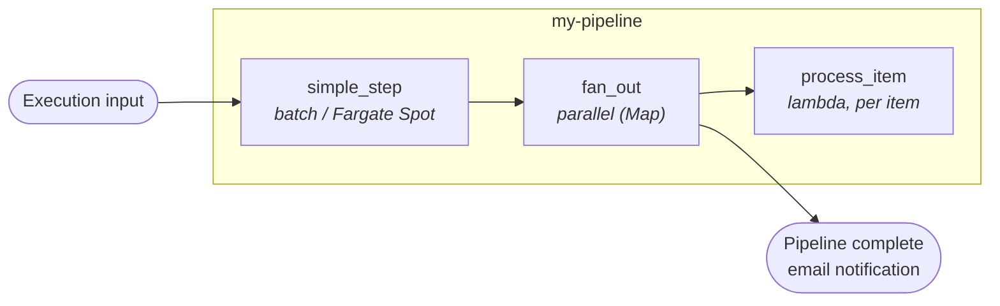

# my-pipeline

Template pipeline you copy to start a new use case. It is a working, deployable Step Functions pipeline that exercises every step type currently supported by the shared `pipeline` module (batch, parallel, lambda) so you can study a real example, then delete what you don't need.

This document is the entry point for creating a new pipeline:

1. Read [What's in here](#whats-in-here) to understand the layout.
2. Read [The pipeline.yaml contract](#the-pipelineyaml-contract) — this is where 90% of your authoring happens.
3. Follow [Define a new pipeline](#define-a-new-pipeline) to scaffold yours.

## Pipeline overview

The template wires the following Step Functions state machine, fully described by [`pipeline.yaml`](pipeline.yaml):



| Step | Type | What it shows |
|------|------|---------------|
| `simple_step` | `batch` | Fargate container reading from `source` bucket, writing to `intermediate`, with verification round-trip. |
| `fan_out` → `process_item` | `parallel` + `lambda` | Discovers S3 prefixes in `intermediate` and fans them out to a Lambda Map iteration. |

## What's in here

```
my-pipeline/
├── pipeline.yaml          # Single source of truth: name, buckets, tags, steps
├── infra/                 # OpenTofu — usually you do NOT edit this
│   ├── main.tf            #   Reads pipeline.yaml, instantiates shared modules
│   ├── variables.tf       #   Account-level inputs (region, vpc, subnets, ...)
│   ├── outputs.tf         #   Step Functions ARN, S3 bucket names
│   └── terraform.tf       #   Provider versions, S3 backend (per-env file)
├── env/
│   └── dev/
│       ├── backend.tfvars #   OpenTofu state bucket / key
│       └── inputs.tfvars  #   Per-env values: region, vpc_id, subnet_ids…
└── code/
    ├── simple_step/       #   Container step (Dockerfile + main.py)
    │   ├── Dockerfile
    │   ├── main.py
    │   ├── pyproject.toml
    │   ├── tests/
    │   └── test-data/
    └── process_item/      #   Lambda step (handler, no Dockerfile)
        ├── main.py
        ├── pyproject.toml
        └── tests/
```

> **Important:** the directory name (`my-pipeline`) is used as a prefix for AWS resource names — most notably S3 buckets — so it MUST follow [S3 bucket naming rules](https://docs.aws.amazon.com/AmazonS3/latest/userguide/bucketnamingrules.html): lowercase letters, digits, and hyphens only. Underscores will fail `tofu apply` with `InvalidBucketName`.

## The pipeline.yaml contract

`pipeline.yaml` is validated by `modules/pipeline/schemas/pipeline.schema.json` (the schema URL is referenced by the YAML language server comment at the top of the file). The OpenTofu in `infra/main.tf` decodes it and passes it to the shared `pipeline` module — you should rarely touch `infra/`.

### Top-level fields

| Field | Required | Default | Description |
|-------|----------|---------|-------------|
| `pipeline_name` | yes | — | Used as a prefix for ECR repos, Step Functions name, S3 buckets. Must match the directory name. |
| `buckets` | no | `["intermediate"]` | List of bucket roles to create. Common: `source`, `intermediate`, `output`. |
| `tags` | no | `{}` | Resource tags applied to everything created by the pipeline. |
| `pipeline_completion_emails` | no | `[]` | Recipients of the SNS notification when an execution completes. |
| `capacity_provider` | no | `FARGATE` | Either `FARGATE` or `FARGATE_SPOT` (cheaper, can be reclaimed). |
| `max_concurrency` | no | `0` | `0` = unlimited concurrent executions. |
| `cw_retention_days` | no | `365` | CloudWatch log retention for all step logs. Must be between `15` and `730` (enforced by both `check-jsonschema` and `tofu apply`). |
| `ssm_parameters` | no | `[]` | SSM parameters provisioned for the pipeline (consumed by steps). |
| `secrets` | no | `[]` | Secrets Manager entries provisioned for the pipeline. |
| `steps` | yes | — | Ordered list of steps — see below. |

### Step types

Each entry in `steps:` declares one of the following types:

#### `batch` — long-running container on AWS Batch / Fargate

```yaml
- name: simple_step          # becomes the ECR repo suffix and SFN state name
  type: batch
  ram_mb: 2048
  vcpu: 1
  image_tag: latest          # tag pulled from ECR at runtime
  copy_to_target: true       # if true, output is copied to the `output` bucket
  runtime_parameters: {}     # optional env-var overrides for the container
```

The pipeline builds an ECR repository named `<pipeline>-<env>-<step>` and the step's image is built from `code/<step>/Dockerfile`.

#### `lambda` — short-lived function

```yaml
- name: process_item
  type: lambda
  lambda_timeout: 60         # seconds
  lambda_memory_size: 512    # MB
```

The step's source must live at `code/<step>/main.py` and expose a `handler(event, context)` callable. The shared module zips and deploys it.

#### `parallel` — Map state with nested steps

```yaml
- name: fan_out
  type: parallel
  input:
    type: s3                 # discover items by listing an S3 prefix
  parallel_steps:
    - name: process_item
      type: lambda
      lambda_timeout: 60
      lambda_memory_size: 512
```

Each item discovered (e.g., each S3 prefix) becomes one iteration of the nested step. The nested step receives `MAP_ITEM` in its event payload.

## Step code conventions

Steps are decoupled from Step Functions by **environment variables**. The shared module injects:

| Variable | Available in | Description |
|----------|--------------|-------------|
| `PIPELINE_NAME` | all | Pipeline identifier. Use as a Powertools log key for log aggregation. |
| `STEP_NAME` | all | Current step name. Useful for log keys and S3 output prefixes. |
| `SFN_EXECUTION_ID` | batch (env), lambda (event) | Top-level S3 prefix for the run. |
| `INTERMEDIATE_BUCKET` | all | The intermediate bucket name. Always present. |
| `SOURCE_BUCKET` / `OUTPUT_BUCKET` | all | Present iff the bucket role is in `buckets:`. |
| `STEP_<previous_step>` | all | Output of any preceding step that returned data. |
| `EXECUTION_INPUT` | all | JSON of the original Step Functions execution input. |

**Lambda steps** receive the same data through the `event` payload (not env vars) for the per-execution fields (`SFN_EXECUTION_ID`, `MAP_ITEM`, `EXECUTION_INPUT`, `STEP_*`).

Look at [`code/simple_step/main.py`](code/simple_step/main.py) and [`code/process_item/main.py`](code/process_item/main.py) for working examples that use `aws_lambda_powertools.Logger` for structured, aggregatable logging.

### Logging

Every step uses Powertools logger keys so logs can be aggregated across the pipeline:

```python
logger = Logger(service="my-pipeline-<step>")
logger.append_keys(step_name=STEP_NAME, pipeline_name=PIPELINE_NAME, run_id=SFN_EXECUTION_ID)
```

> **Security — do NOT log raw `STEP_*` or `EXECUTION_INPUT` at INFO.**
> These payloads are caller-supplied and may contain sensitive data (customer records, PII, tokens). Example steps in this repo log only presence and size at INFO and gate raw values behind `DEBUG` (`POWERTOOLS_LOG_LEVEL=DEBUG`). Keep that pattern when copying this template into production so you do not accidentally spill upstream data into CloudWatch Logs. See <https://docs.powertools.aws.dev/lambda/python/latest/core/logger/>.

## Environment configuration

`env/<env>/inputs.tfvars` carries the values that change per AWS account / environment:

| Variable | Description |
|----------|-------------|
| `region` | AWS region for all resources. |
| `environment` | `dev` / `int` / `prod`. Used as a suffix in resource names. |
| `vpc_id`, `subnet_ids` | Where Fargate tasks and Lambdas are placed. |
| `ecr_force_delete` | `true` only in dev — allows `tofu destroy` to remove ECR repos that still hold images. |

`env/<env>/backend.tfvars` points at the per-environment OpenTofu state bucket and key.

To support more environments, add `env/int/`, `env/prod/`, etc. with the same two files.

## Define a new pipeline

You almost never write a pipeline from scratch — you copy this directory.

### 1. Copy and rename

```bash
cp -R my-pipeline my-new-pipeline
cd my-new-pipeline
```

Update `pipeline.yaml`:

```yaml
pipeline_name: my-new-pipeline   # MUST match the directory name (S3-safe: lowercase, digits, hyphens)
```

Update the OpenTofu state key in `env/<env>/backend.tfvars`:

```hcl
key = "tf-my-new-pipeline.tfstate"
```

### 2. Trim or extend the steps

Edit `pipeline.yaml` — add, remove, or reorder entries in the `steps:` list. For each step you keep, decide its type ([catalog above](#step-types)).

For each step you keep, the matching directory must exist under `code/<step-name>/`. Delete any code directories you no longer need. For each new step you add:

```bash
mkdir -p code/<step-name>/tests
# Copy from a sibling step that has the same type — batch from simple_step,
# lambda from process_item — and edit main.py / pyproject.toml / Dockerfile.
```

### 3. Wire CI/CD

This repository ships no CI/CD workflows. If you add them, the intended behavior is that pushing changes under `<pipeline>/infra/**` or `<pipeline>/code/**` is enough for CI to pick the pipeline up automatically — the workflow detects changed directories. Until then, deploy with the Makefile targets below.

### 4. Deploy

From the repository root, using the top-level [`Makefile`](../../Makefile):

```bash
# Plan and run Checkov on the infra
make checkov-check DEPLOYMENT=my-new-pipeline

# Apply (interactive)
make tofu-apply DEPLOYMENT=my-new-pipeline

# Build and push a step image to ECR locally
make push-image-local DIR=my-new-pipeline/code/<step-name> IMAGE_TAG=1.0.0
make update-parameter-store DIR=my-new-pipeline/code/<step-name> IMAGE_TAG=1.0.0
```

> For a one-shot infra + all-images deploy, run `make deploy DEPLOYMENT=my-new-pipeline` — this chains `tofu-plan` → `checkov-check` → `tofu-apply` → `deploy-all-images`.

> **Before you start the first execution** the pipeline reads objects from the **source** S3 bucket. If the bucket is empty, `simple_step` finds no session prefixes and the state machine fails. Seed the bucket with the fixture data shipped in `code/simple_step/test-data/` — see [Testing the deployed pipeline](#testing-the-deployed-pipeline) below for the exact `aws s3 sync` command.

## Local development cheat sheet

All Make targets run from the repository root.

| Goal | Command |
|------|---------|
| Run unit tests for a step | `make unit-tests DIR=my-pipeline/code/<step>` |
| Build the Docker image | `make build-image DIR=my-pipeline/code/<step>` |
| Push to ECR (local) | `make push-image-local DIR=my-pipeline/code/<step> IMAGE_TAG=1.0.0` |
| Bump the deployed tag | `make update-parameter-store DIR=my-pipeline/code/<step> IMAGE_TAG=1.0.0` |
| Plan the pipeline | `make tofu-plan DEPLOYMENT=my-pipeline` |
| Plan + Checkov | `make checkov-check DEPLOYMENT=my-pipeline` |
| Apply | `make tofu-apply DEPLOYMENT=my-pipeline` |
| Full deploy (infra + all images) | `make deploy DEPLOYMENT=my-pipeline` |

See the [examples README](../README.md) for the full Makefile reference and prerequisites.

## Testing the deployed pipeline

> **You must seed the source bucket before the first execution.** The `simple_step` batch job enumerates session prefixes under `input/simulation-data/` in the pipeline's **source** S3 bucket. An empty bucket causes the state machine to fail on the first step with no items to process.

1. Get the source bucket name from the deployment outputs:

   ```bash
   tofu -chdir=my-pipeline/infra output -raw s3_bucket_names | jq -r .source
   # or, from the AWS console: S3 → search "<pipeline>-<env>-source-"
   ```

2. Upload the fixture data shipped with this template — see [`code/simple_step/test-data/README.md`](code/simple_step/test-data/README.md) for the layout:

   ```bash
   aws s3 sync examples/my-pipeline/code/simple_step/test-data/ \
     s3://<source-bucket>/
   ```

   You should see `input/simulation-data/session-001/data.jsonl` and `input/simulation-data/session-002/data.jsonl` in the bucket afterwards.

3. Start an execution from the AWS console (Step Functions → state machine `<pipeline>-<env>`) with input:

   ```json
   { "inputs": { "root_prefix": "input/simulation-data" } }
   ```

4. Watch logs in CloudWatch: the `simple_step` batch job logs to `/aws/batch/<pipeline>-<env>`, and each lambda step (e.g. `process_item`) has its own group `/aws/lambda/<pipeline>-<env>-step-<step>` — Powertools log keys (`pipeline_name`, `step_name`, `run_id`) make cross-step queries trivial.

## Destroy

```bash
make tofu-destroy DEPLOYMENT=my-pipeline
```

Set `ecr_force_delete = true` in `env/<env>/inputs.tfvars` before destroying if ECR repositories still hold images. Bucket contents are not force-emptied — see [TROUBLESHOOTING.md](../../TROUBLESHOOTING.md#tofu-destroy-leaves-s3-buckets-behind).

## Reference

- [Examples README](../README.md) — examples setup, prerequisites, pre-commit
- [Platform README](../../README.md) — repository overview
- [Platform modules](../../infra/modules) — `pipeline`, `pipeline-initialization`, `lambda-alarms`, and the `pipeline.yaml` JSON schema
