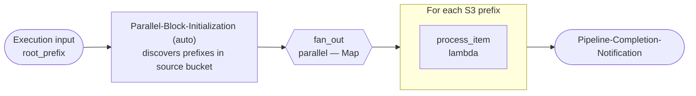

<!-- Copyright Amazon.com, Inc. or its affiliates. All Rights Reserved. SPDX-License-Identifier: MIT-0 -->

# s3-parallel-first

Integration-test pipeline that verifies the case where the **parallel block is the very first step** and the fan-out array is discovered by listing prefixes on the **source bucket** using `root_prefix` from the execution payload.

Full pipeline definition: [`pipeline.yaml`](pipeline.yaml). The OpenTofu under [`infra/`](infra/main.tf) only decodes the YAML and calls the shared modules — see the [`pipeline` module README](../../infra/modules/pipeline/README.md).

## What it demonstrates

- `parallel` step with **S3 discovery mode** (`input.type: s3`) as the first step in the pipeline.
- The injected `Parallel-Block-Initialization` Lambda listing the source bucket under `<root_prefix>/` (from the execution input) to build the fan-out array.
- A single lambda `process_item` executed once per discovered prefix, receiving the item under `MAP_ITEM` in its event payload.

## Architecture



`Parallel-Block-Initialization` and `Pipeline-Completion-Notification` are injected automatically by the module.

## Layout

```
s3-parallel-first/
├── pipeline.yaml         # Two buckets: source + intermediate. One parallel step containing a lambda.
├── infra/                # OpenTofu — decodes pipeline.yaml, calls shared modules
├── env/dev/              # backend.tfvars.example + inputs.tfvars.example
└── code/
    └── process_item/     # lambda step (no Dockerfile, handler in main.py)
```

## Prerequisites

- Account bootstrap completed (`cd infra/deployments && make all`).
- `env/dev/backend.tfvars` and `env/dev/inputs.tfvars` created from the `.example` files with real values.

```bash
cd examples/s3-parallel-first/env/dev
cp backend.tfvars.example backend.tfvars
cp inputs.tfvars.example  inputs.tfvars
$EDITOR backend.tfvars inputs.tfvars
```

## Deploy

Run from the repository root.

```bash
# Plan only
make tofu-plan DEPLOYMENT=s3-parallel-first

# Plan + Checkov security scan
make checkov-check DEPLOYMENT=s3-parallel-first

# Full deploy (infra + lambda code)
make deploy DEPLOYMENT=s3-parallel-first
```

Only `process_item` needs an image/zip built; `make deploy` picks it up automatically.

## Verify

1. Upload a few objects that share a set of prefixes into the source bucket, e.g.:
   ```bash
   aws s3 cp file.json s3://<source-bucket>/input/set-a/item-1.json
   aws s3 cp file.json s3://<source-bucket>/input/set-a/item-2.json
   aws s3 cp file.json s3://<source-bucket>/input/set-b/item-1.json
   ```
2. Start an execution pointing at the common root prefix:
   ```bash
   aws stepfunctions start-execution \
     --state-machine-arn "arn:aws:states:$AWS_REGION:$AWS_ACCOUNT_ID:stateMachine:s3-parallel-first-dev" \
     --input '{"inputs": {"type": "s3", "root_prefix": "input"}}'
   ```
3. `Parallel-Block-Initialization` should list `s3://<source-bucket>/input/` and hand two items (`set-a`, `set-b`) to the Map state — one `process_item` iteration runs per prefix.
4. Logs are aggregated in CloudWatch under `/aws/lambda/s3-parallel-first-dev-step-process_item`.

## Destroy

```bash
make tofu-destroy DEPLOYMENT=s3-parallel-first
```

For dev accounts, keep `ecr_force_delete = true` in `env/dev/inputs.tfvars` so the destroy can remove ECR repos that still hold images. Bucket contents are not force-emptied.

## Known issues

Common failure modes and workarounds are collected in the repo-wide [TROUBLESHOOTING.md](../../TROUBLESHOOTING.md) — in particular:

- [`Parallel-Block-Initialization` fails immediately](../../TROUBLESHOOTING.md#step-functions-execution-fails-immediately-on-parallel-block-initialization) — usually a missing `INTERMEDIATE_BUCKET` after a partial destroy.
- [`MAP_ITEM` is a single string when I expected a list](../../TROUBLESHOOTING.md#map_item-is-a-single-string-when-i-expected-a-list) — `MAP_ITEM` is always the current iteration's element.

## Reference

- [Examples README](../README.md) · [Repository guide](../../README.md)
- [`pipeline` module](../../infra/modules/pipeline/README.md) · [`pipeline.yaml` schema](../../infra/modules/pipeline/schemas/README.md)
- Sibling integration tests: [`s3-parallel-middle`](../s3-parallel-middle/README.md) · [`s3-parallel-from-step`](../s3-parallel-from-step/README.md) · [`end-to-end`](../end-to-end/README.md)

## License

MIT-0. Every source file in this directory carries an `SPDX-License-Identifier: MIT-0` header.
