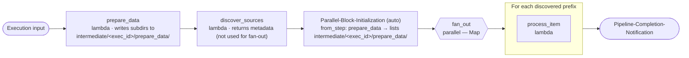

<!-- Copyright Amazon.com, Inc. or its affiliates. All Rights Reserved. SPDX-License-Identifier: MIT-0 -->

# s3-parallel-from-step

Integration-test pipeline that verifies the **explicit `from_step`** discovery option: a `parallel` block with `input.type: s3` and `input.from_step: <step_name>` targets an **earlier, non-adjacent step's output** on the intermediate bucket for fan-out.

Full pipeline definition: [`pipeline.yaml`](pipeline.yaml). The OpenTofu under [`infra/`](infra/main.tf) only decodes the YAML and calls the shared modules — see the [`pipeline` module README](../../infra/modules/pipeline/README.md).

## What it demonstrates

- `parallel` step with **S3 discovery mode** and an **explicit `from_step: prepare_data`**.
- The intermediate step (`discover_sources`) sits between `prepare_data` and the parallel block — its output is **not** what the fan-out iterates over. This is the whole point of `from_step`.
- Everything else is minimal: only the `intermediate` bucket, three simple lambdas.

## Architecture



Compare with [`s3-parallel-middle`](../s3-parallel-middle/README.md) — the difference is a single `from_step` field in `pipeline.yaml`, which decouples the fan-out target from the previous step.

## Layout

```
s3-parallel-from-step/
├── pipeline.yaml         # One bucket (intermediate). Three lambdas; parallel targets prepare_data explicitly.
├── infra/                # OpenTofu — decodes pipeline.yaml, calls shared modules
├── env/dev/              # backend.tfvars.example + inputs.tfvars.example
└── code/
    ├── prepare_data/     # lambda — writes fan-out subdirectories
    ├── discover_sources/ # lambda — sits between prepare_data and the parallel block
    └── process_item/     # lambda — runs once per discovered subdirectory
```

## Prerequisites

- Account bootstrap completed (`cd infra/deployments && make all`).
- `env/dev/backend.tfvars` and `env/dev/inputs.tfvars` created from the `.example` files with real values.

```bash
cd examples/s3-parallel-from-step/env/dev
cp backend.tfvars.example backend.tfvars
cp inputs.tfvars.example  inputs.tfvars
$EDITOR backend.tfvars inputs.tfvars
```

## Deploy

Run from the repository root.

```bash
# Plan only
make tofu-plan DEPLOYMENT=s3-parallel-from-step

# Plan + Checkov security scan
make checkov-check DEPLOYMENT=s3-parallel-from-step

# Full deploy
make deploy DEPLOYMENT=s3-parallel-from-step
```

## Verify

1. Start an execution:
   ```bash
   aws stepfunctions start-execution \
     --state-machine-arn "arn:aws:states:$AWS_REGION:$AWS_ACCOUNT_ID:stateMachine:s3-parallel-from-step-dev" \
     --input '{"inputs": {}}'
   ```
2. `prepare_data` writes subdirectories under `s3://<intermediate-bucket>/<execution_id>/prepare_data/`. `discover_sources` runs but its return value does **not** drive the fan-out.
3. `Parallel-Block-Initialization` lists `s3://<intermediate-bucket>/<execution_id>/prepare_data/` (because `from_step: prepare_data`) and the Map state runs one `process_item` per prefix found.
4. Logs are in CloudWatch under `/aws/lambda/s3-parallel-from-step-dev-step-<step>`.

## Destroy

```bash
make tofu-destroy DEPLOYMENT=s3-parallel-from-step
```

## Known issues

- [`Parallel-Block-Initialization` fails immediately](../../TROUBLESHOOTING.md#step-functions-execution-fails-immediately-on-parallel-block-initialization).
- [`MAP_ITEM` is a single string when I expected a list](../../TROUBLESHOOTING.md#map_item-is-a-single-string-when-i-expected-a-list).

Full list: [TROUBLESHOOTING.md](../../TROUBLESHOOTING.md).

## Reference

- [Examples README](../README.md) · [Repository guide](../../README.md)
- [`pipeline` module](../../infra/modules/pipeline/README.md) · [`pipeline.yaml` schema](../../infra/modules/pipeline/schemas/README.md)
- Sibling integration tests: [`s3-parallel-first`](../s3-parallel-first/README.md) · [`s3-parallel-middle`](../s3-parallel-middle/README.md) · [`end-to-end`](../end-to-end/README.md)

## License

MIT-0. Every source file in this directory carries an `SPDX-License-Identifier: MIT-0` header.
