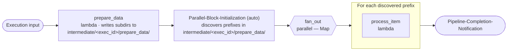

<!-- Copyright Amazon.com, Inc. or its affiliates. All Rights Reserved. SPDX-License-Identifier: MIT-0 -->

# s3-parallel-middle

Integration-test pipeline that verifies **S3 fan-out from a previous step's output**. A lambda step runs first and writes subdirectories under `intermediate/<execution_id>/prepare_data/`; the following `parallel` block then discovers those subdirectories **without an explicit `from_step`** — the shared module wires the discovery to the previous step automatically.

Full pipeline definition: [`pipeline.yaml`](pipeline.yaml). The OpenTofu under [`infra/`](infra/main.tf) only decodes the YAML and calls the shared modules — see the [`pipeline` module README](../../infra/modules/pipeline/README.md).

## What it demonstrates

- `parallel` step with **S3 discovery mode** (`input.type: s3`) **positioned after another step**.
- Implicit chaining: with no `from_step`, `Parallel-Block-Initialization` lists the previous step's output prefix on the intermediate bucket (`<execution_id>/prepare_data/`).
- Minimal bucket set — only `intermediate` is required; no `source` bucket.

## Architecture



`Parallel-Block-Initialization` and `Pipeline-Completion-Notification` are injected automatically by the module.

## Layout

```
s3-parallel-middle/
├── pipeline.yaml         # One bucket (intermediate). Two lambdas — prepare_data then a parallel wrapping process_item.
├── infra/                # OpenTofu — decodes pipeline.yaml, calls shared modules
├── env/dev/              # backend.tfvars.example + inputs.tfvars.example
└── code/
    ├── prepare_data/     # lambda — writes fan-out subdirectories to intermediate
    └── process_item/     # lambda — runs once per discovered subdirectory
```

## Prerequisites

- Account bootstrap completed (`cd infra/deployments && make all`).
- `env/dev/backend.tfvars` and `env/dev/inputs.tfvars` created from the `.example` files with real values.

```bash
cd examples/s3-parallel-middle/env/dev
cp backend.tfvars.example backend.tfvars
cp inputs.tfvars.example  inputs.tfvars
$EDITOR backend.tfvars inputs.tfvars
```

## Deploy

Run from the repository root.

```bash
# Plan only
make tofu-plan DEPLOYMENT=s3-parallel-middle

# Plan + Checkov security scan
make checkov-check DEPLOYMENT=s3-parallel-middle

# Full deploy
make deploy DEPLOYMENT=s3-parallel-middle
```

## Verify

1. Start an execution — no input is required for the fan-out logic itself, but supply a JSON object so `EXECUTION_INPUT` is well-formed:
   ```bash
   aws stepfunctions start-execution \
     --state-machine-arn "arn:aws:states:$AWS_REGION:$AWS_ACCOUNT_ID:stateMachine:s3-parallel-middle-dev" \
     --input '{"inputs": {}}'
   ```
2. `prepare_data` should write one or more subdirectories under `s3://<intermediate-bucket>/<execution_id>/prepare_data/`. Inspect what it produced:
   ```bash
   aws s3 ls s3://<intermediate-bucket>/<execution_id>/prepare_data/
   ```
3. The Map state should run one `process_item` iteration per subdirectory found.
4. Logs are aggregated in CloudWatch under `/aws/lambda/s3-parallel-middle-dev-step-<step>`.

## Destroy

```bash
make tofu-destroy DEPLOYMENT=s3-parallel-middle
```

## Known issues

- [`Parallel-Block-Initialization` fails immediately](../../TROUBLESHOOTING.md#step-functions-execution-fails-immediately-on-parallel-block-initialization) — check `INTERMEDIATE_BUCKET` is populated after any partial state operations.
- [`MAP_ITEM` is a single string when I expected a list](../../TROUBLESHOOTING.md#map_item-is-a-single-string-when-i-expected-a-list).

Full list: [TROUBLESHOOTING.md](../../TROUBLESHOOTING.md).

## Security notes

- **Do NOT log raw `STEP_*` or `EXECUTION_INPUT` at INFO.** These payloads are caller-supplied and may contain sensitive data. The steps in this example log only key presence at INFO and gate raw values behind `DEBUG` (`POWERTOOLS_LOG_LEVEL=DEBUG`). Preserve that pattern when copying step code into production. See <https://docs.powertools.aws.dev/lambda/python/latest/core/logger/>.

## Reference

- [Examples README](../README.md) · [Repository guide](../../README.md)
- [`pipeline` module](../../infra/modules/pipeline/README.md) · [`pipeline.yaml` schema](../../infra/modules/pipeline/schemas/README.md)
- Sibling integration tests: [`s3-parallel-first`](../s3-parallel-first/README.md) · [`s3-parallel-from-step`](../s3-parallel-from-step/README.md) · [`end-to-end`](../end-to-end/README.md)

## License

MIT-0. Every source file in this directory carries an `SPDX-License-Identifier: MIT-0` header.
