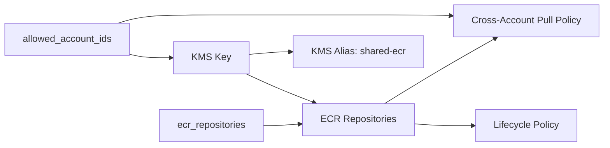

<!-- Copyright Amazon.com, Inc. or its affiliates. All Rights Reserved. SPDX-License-Identifier: MIT-0 -->

# central-ecr

Shared ECR module that creates container image repositories with cross-account KMS encryption, immutable tags (with a `latest` exclusion filter), cross-account pull policies for ECS/Batch, and a cost-optimising lifecycle policy.

## Architecture



## Usage

```hcl
module "central_ecr" {
  source = "../modules/central-ecr"

  ecr_repositories    = ["copy-intermediate-to-output", "my-model"]
  allowed_account_ids = ["111111111111", "222222222222"]
}
```

## ECR lifecycle policy

Every repository gets a lifecycle policy with four stacked rules (ascending `rulePriority`, first match wins):

| Priority | Rule | Variable | Default |
|---------:|------|----------|---------|
| 1 | Always keep the image tagged exactly `latest` | _unconditional_ | — |
| 2 | Keep the N most recently pushed tagged images (any tag) | `ecr_keep_tagged_count` | `3` |
| 3 | Expire untagged images older than N days | `ecr_expire_untagged_days` | `7` |
| 4 | Transition to ECR archive storage images not pulled in N days | `ecr_archive_unpulled_days` | `90` |

Rule 4 uses `transition` (not `expire`) so cold images stay retrievable but move to cheaper ECR archive storage. Rule 1 is unconditional. Rules 2–4 can each be disabled with `null`.

## Requirements

| Name | Version |
|------|---------|
| terraform | >= 1.8 |
| aws | ~> 6.0 |

## Inputs

| Name | Description | Type | Default | Required |
|------|-------------|------|---------|:--------:|
| `ecr_repositories` | Name of ECR repositories to create | `list(string)` | n/a | yes |
| `allowed_account_ids` | AWS account IDs allowed to pull images and decrypt with the shared KMS key | `list(string)` | n/a | yes |
| `ecr_force_delete` | Force delete ECR repositories even if they contain images | `bool` | `false` | no |
| `ecr_scan_on_push` | Enable ECR basic scanning on image push | `bool` | `true` | no |
| `ecr_keep_tagged_count` | Keep the N most recently pushed tagged images (any tag). `null` disables. | `number` | `3` | no |
| `ecr_expire_untagged_days` | Expire untagged images after N days. `null` disables. | `number` | `7` | no |
| `ecr_archive_unpulled_days` | Transition to archive images not pulled in N days. `null` disables. | `number` | `90` | no |

## Outputs

| Name | Description |
|------|-------------|
| `shared_ecrs` | Shared Batch ECR Repository URLs |

## SSM parameters

Each repository publishes its URL as an SSM parameter at `/pipelines/shared-<repo-name>-ecr-url` so consuming pipelines can look it up without hard-coding ARNs.
