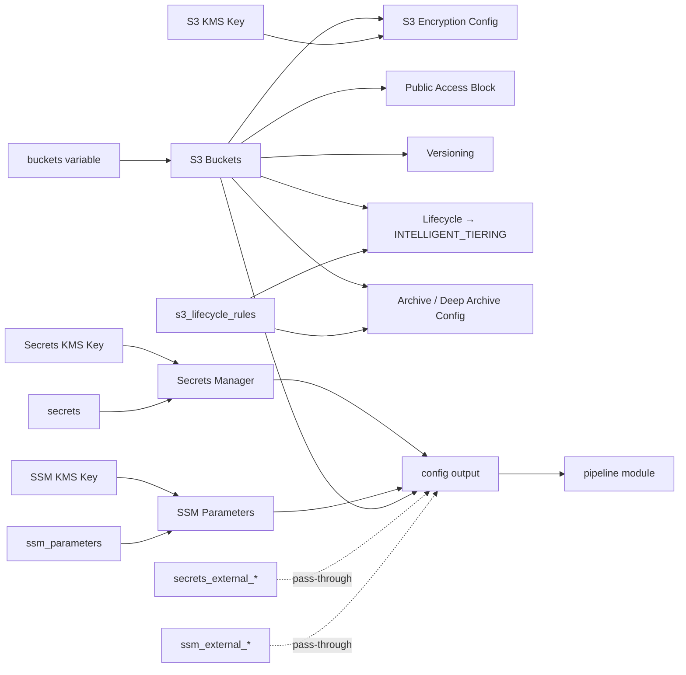

<!-- Copyright Amazon.com, Inc. or its affiliates. All Rights Reserved. SPDX-License-Identifier: MIT-0 -->

# pipeline-initialization

Creates S3 buckets, SSM parameters, and Secrets Manager secrets for ML pipeline data storage and configuration. The `intermediate` bucket is always created; `source` and `output` buckets are optional. SSM parameters and secrets are optional.

This module exposes a `config` output object designed to be passed directly to the `pipeline` module's `initialization` variable, providing a clean contract between infrastructure provisioning and pipeline orchestration.

## Tagging

All resources created by both this module and the downstream `pipeline` module receive a consistent set of tags. The `tags` variable (from the pipeline YAML) is merged with automatically computed tags:

| Tag | Source | Description |
|-----|--------|-------------|
| `Pipeline` | Auto | Pipeline name |
| `Environment` | Auto | Deployment environment |
| `DeployedBy` | Auto | Always `"OpenTofu"` |
| `Owner` | Auto | Always `"workflow-platform"` (overrides any `Owner` supplied in the `tags` variable) |
| *(custom)* | `tags` variable | Any additional tags from the pipeline YAML |

These merged tags are passed to the `pipeline` module via the `config` output, so tagging is defined once and applied consistently across all resources. Do not add `Pipeline`, `Environment`, or `DeployedBy` to provider `default_tags` — this module handles them.

## Architecture



## Usage

### Basic (storage only)

```hcl
module "pipeline_init" {
  source = "../modules/pipeline-initialization"

  pipeline_name = "my-pipeline"
  environment   = "dev"
  region        = "us-east-1"
  buckets       = ["source", "intermediate", "output"]
}

module "pipeline" {
  source = "../modules/pipeline"

  initialization = module.pipeline_init.config
  # ... other pipeline config
}
```

### With SSM parameters and secrets

```hcl
module "pipeline_init" {
  source = "../modules/pipeline-initialization"

  pipeline_name = "my-pipeline"
  environment   = "dev"
  region        = "us-east-1"
  buckets       = ["source", "intermediate", "output"]

  ssm_parameters = ["external_api_key", "log_level"]

  secrets = [
    { name = "db_password" },
    { name = "api_token" },
  ]
}
```

### Bring your own KMS keys

```hcl
module "pipeline_init" {
  source = "../modules/pipeline-initialization"

  pipeline_name = "my-pipeline"
  environment   = "dev"
  region        = "us-east-1"
  buckets       = ["intermediate"]

  ssm_parameters  = ["api_key"]
  ssm_kms_key_arn = aws_kms_key.my_ssm_key.arn

  secrets = [
    { name = "db_password" },
  ]
  secrets_kms_key_arn = aws_kms_key.my_secrets_key.arn
}
```

## S3 Intelligent-Tiering

Every bucket created by this module gets, by default, a lifecycle rule that transitions all objects to the `INTELLIGENT_TIERING` storage class at day 0. From there, S3 handles the Frequent → Infrequent (30d) → Archive Instant Access (90d) transitions automatically at no extra cost.

The same lifecycle configuration also aborts incomplete multipart uploads after 7 days so orphaned parts don't accrue storage charges.

To opt in to the cheaper asynchronous tiers (`ARCHIVE_ACCESS` min 90 days, `DEEP_ARCHIVE_ACCESS` min 180 days), add per-bucket entries to `s3_lifecycle_rules`:

```hcl
module "pipeline_init" {
  source = "../modules/pipeline-initialization"

  pipeline_name = "my-pipeline"
  environment   = "dev"
  region        = "us-east-1"
  buckets       = ["source", "intermediate", "output"]

  s3_lifecycle_rules = {
    # Source: cheap long-term archival — data pulled infrequently
    source = {
      archive_access_days      = 90
      deep_archive_access_days = 180
    }
    # Output: archive after 90 days of no access
    output = { archive_access_days = 90 }
    # Intermediate: omitted → IT enabled, no archive tiers (default)
  }
}
```

Set `enabled = false` on a bucket to skip Intelligent-Tiering entirely for that one:

```hcl
s3_lifecycle_rules = {
  intermediate = { enabled = false }   # keep objects in STANDARD
}
```

Keys in `s3_lifecycle_rules` must match one of `source`, `intermediate`, `output`.

## SSM parameters

SSM parameters are simple key-value pairs stored as `SecureString` entries in AWS Systems Manager Parameter Store. They are suited for configuration values that your pipeline steps need at runtime (API keys, feature flags, endpoint URLs, etc.).

Parameters are created under the path:

```
/pipelines/<pipeline_name>-<environment>/params/<name>
```

OpenTofu creates each parameter with a placeholder `REPLACE_ME` value and ignores future changes via `lifecycle { ignore_changes }`. Set the real value outside OpenTofu:

```bash
aws ssm put-parameter \
  --name "/pipelines/my-pipeline-dev/params/api_key" \
  --value "real-secret-value" \
  --type SecureString \
  --overwrite
```

Each parameter is encrypted with a dedicated KMS key. The module auto-generates this key unless you provide one via `ssm_kms_key_arn`.

## Secrets Manager

Secrets Manager secrets are designed for sensitive credentials (database passwords, OAuth tokens, service credentials, etc.).

Secrets are created under the path:

```
/pipelines/<pipeline_name>-<environment>/secrets/<name>
```

The `secrets` variable accepts a list of objects:

| Field  | Type     | Default | Description                                        |
|--------|----------|---------|----------------------------------------------------|
| `name` | `string` | —       | Name of the secret (used as the last path segment) |

Example:

```hcl
secrets = [
  { name = "db_password" },
  { name = "api_token" },
]
```

Same placeholder pattern as SSM — set the real value outside OpenTofu:

```bash
aws secretsmanager put-secret-value \
  --secret-id "/pipelines/my-pipeline-dev/secrets/db_password" \
  --secret-string "real-secret-value"
```

Each secret is encrypted with a dedicated KMS key. The module auto-generates this key unless you provide one via `secrets_kms_key_arn`.

## SSM parameters vs Secrets Manager — when to use which

| Criteria              | SSM Parameter Store          | Secrets Manager                        |
|-----------------------|------------------------------|----------------------------------------|
| Cost                  | Free for standard parameters | Per-secret per-month charge            |
| Max value size        | 4 KB (advanced: 8 KB)        | 64 KB                                  |
| Best for              | Config values, feature flags | Database credentials, API tokens, certs|

Use SSM parameters for values that change infrequently. Use Secrets Manager when the consuming AWS service integrates natively with it (e.g., RDS, Redshift).

## External ARNs (cross-account or pre-existing resources)

Sometimes your pipeline steps need read access to SSM parameters or Secrets Manager secrets that are managed outside this module — for example, parameters owned by another team, shared across pipelines, or living in a different AWS account.

The module does not create or manage these resources. Instead, it passes their ARNs through to the `config` output so the downstream `pipeline` module can grant the appropriate IAM permissions (`ssm:GetParameter`, `secretsmanager:GetSecretValue`, `kms:Decrypt`) to the Batch task role.

### External SSM parameters

```hcl
module "pipeline_init" {
  source = "../modules/pipeline-initialization"

  pipeline_name = "my-pipeline"
  environment   = "dev"
  region        = "us-east-1"
  buckets       = ["intermediate"]

  # Parameters managed by this module
  ssm_parameters = ["local_config"]

  # Parameters managed elsewhere — only IAM read access is granted
  ssm_external_parameter_arns = [
    "arn:aws:ssm:us-east-1:999888777666:parameter/shared/api-endpoint",
    "arn:aws:ssm:us-east-1:999888777666:parameter/shared/feature-flags",
  ]
  # KMS keys used to encrypt those external parameters (needed for kms:Decrypt)
  ssm_external_kms_key_arns = [
    "arn:aws:kms:us-east-1:999888777666:key/abcd-1234-efgh-5678",
  ]
}
```

### External Secrets Manager secrets

```hcl
module "pipeline_init" {
  source = "../modules/pipeline-initialization"

  pipeline_name = "my-pipeline"
  environment   = "dev"
  region        = "us-east-1"
  buckets       = ["intermediate"]

  # Secrets managed by this module
  secrets = [{ name = "local_db_password" }]

  # Secrets managed elsewhere — only IAM read access is granted
  secrets_external_arns = [
    "arn:aws:secretsmanager:us-east-1:999888777666:secret:shared/third-party-api-key-AbCdEf",
  ]
  # KMS keys used to encrypt those external secrets
  secrets_external_kms_key_arns = [
    "arn:aws:kms:us-east-1:999888777666:key/wxyz-9876-stuv-5432",
  ]
}
```

### How it flows

1. You declare external ARNs and their KMS keys in `pipeline_init`.
2. The module includes them in the `config` output under `ssm.external_arns` / `ssm.external_kms_keys` and `secrets.external_arns` / `secrets.external_kms_keys`.
3. The `pipeline` module reads these from `var.initialization` and attaches the necessary IAM policy statements to the Batch task role.
4. At runtime, your container can call `GetParameter` or `GetSecretValue` on those external resources.

> **Note:** For cross-account access, the source account must also have a resource policy on the parameter/secret (and KMS key policy) that allows your pipeline account to read it. This module only handles the IAM side in the pipeline account.

<!-- BEGIN_TF_DOCS -->


## Requirements

| Name | Version |
|------|---------|
| <a name="requirement_terraform"></a> [terraform](#requirement\_terraform) | >= 1.8 |
| <a name="requirement_aws"></a> [aws](#requirement\_aws) | ~> 6.0 |

## Providers

| Name | Version |
|------|---------|
| <a name="provider_aws"></a> [aws](#provider\_aws) | ~> 6.0 |

## Modules

No modules.

## Resources

| Name | Type |
|------|------|
| aws_kms_alias.cloudwatch | resource |
| aws_kms_alias.s3_encryption | resource |
| aws_kms_alias.secrets | resource |
| aws_kms_alias.ssm | resource |
| aws_kms_key.cloudwatch | resource |
| aws_kms_key.s3_encryption | resource |
| aws_kms_key.secrets | resource |
| aws_kms_key.ssm | resource |
| aws_s3_bucket.buckets | resource |
| aws_s3_bucket_intelligent_tiering_configuration.buckets | resource |
| aws_s3_bucket_lifecycle_configuration.buckets | resource |
| aws_s3_bucket_public_access_block.buckets | resource |
| aws_s3_bucket_server_side_encryption_configuration.buckets | resource |
| aws_s3_bucket_versioning.buckets | resource |
| aws_secretsmanager_secret.placeholder | resource |
| aws_secretsmanager_secret_version.placeholder | resource |
| aws_ssm_parameter.placeholder | resource |
| aws_caller_identity.current | data source |
| aws_iam_policy_document.cloudwatch_kms_key | data source |
| aws_iam_policy_document.s3_encryption_key | data source |
| aws_iam_policy_document.secrets_kms_key | data source |
| aws_iam_policy_document.ssm_kms_key | data source |

## Inputs

| Name | Description | Type | Default | Required |
|------|-------------|------|---------|:--------:|
| <a name="input_buckets"></a> [buckets](#input\_buckets) | Set of bucket suffixes to create. Must always include 'intermediate'. | `set(string)` | <pre>[<br/>  "intermediate"<br/>]</pre> | no |
| <a name="input_environment"></a> [environment](#input\_environment) | Environment name (dev, staging, prod) | `string` | `"dev"` | no |
| <a name="input_pipeline_name"></a> [pipeline\_name](#input\_pipeline\_name) | Name of the pipeline | `string` | n/a | yes |
| <a name="input_region"></a> [region](#input\_region) | AWS Region | `string` | n/a | yes |
| <a name="input_s3_force_destroy"></a> [s3\_force\_destroy](#input\_s3\_force\_destroy) | Whether to force S3 bucket destroy or not | `bool` | `false` | no |
| <a name="input_s3_lifecycle_rules"></a> [s3\_lifecycle\_rules](#input\_s3\_lifecycle\_rules) | Per-bucket S3 Intelligent-Tiering configuration. Keys must match bucket names<br/>(source, intermediate, output). Buckets not listed get the default (enabled, no archive tiers).<br/>- enabled: create a lifecycle rule that transitions objects to INTELLIGENT\_TIERING at day 0 (default: true)<br/>- archive\_access\_days: opt-in Archive Access tier (min 90, null to disable)<br/>- deep\_archive\_access\_days: opt-in Deep Archive Access tier (min 180, null to disable) | <pre>map(object({<br/>    enabled                  = optional(bool, true)<br/>    archive_access_days      = optional(number, null)<br/>    deep_archive_access_days = optional(number, null)<br/>  }))</pre> | `{}` | no |
| <a name="input_secrets"></a> [secrets](#input\_secrets) | Secrets to create as placeholders under /pipelines/<pipeline\_name>-<environment>/secrets/<name>.<br/>OpenTofu creates each secret with a dummy value and ignores future changes.<br/>Set the real value outside OpenTofu (CLI or console). | <pre>list(object({<br/>    name = string<br/>  }))</pre> | `[]` | no |
| <a name="input_secrets_external_arns"></a> [secrets\_external\_arns](#input\_secrets\_external\_arns) | List of ARNs of externally managed Secrets Manager secrets that batch jobs need read access to. The initialization module will not create these secrets — it only passes them through to the pipeline module for IAM grants. | `list(string)` | `[]` | no |
| <a name="input_secrets_external_kms_key_arns"></a> [secrets\_external\_kms\_key\_arns](#input\_secrets\_external\_kms\_key\_arns) | List of KMS key ARNs used to encrypt the externally managed secrets. Passed through to the pipeline module so it can grant kms:Decrypt to the batch task role. | `list(string)` | `[]` | no |
| <a name="input_secrets_kms_key_arn"></a> [secrets\_kms\_key\_arn](#input\_secrets\_kms\_key\_arn) | ARN of an existing customer managed KMS key for Secrets Manager encryption. When null and secrets is non-empty, the module creates a dedicated KMS key automatically. | `string` | `null` | no |
| <a name="input_ssm_external_kms_key_arns"></a> [ssm\_external\_kms\_key\_arns](#input\_ssm\_external\_kms\_key\_arns) | List of KMS key ARNs used to encrypt the externally managed SSM parameters. Passed through to the pipeline module so it can grant kms:Decrypt to the batch task role. | `list(string)` | `[]` | no |
| <a name="input_ssm_external_parameter_arns"></a> [ssm\_external\_parameter\_arns](#input\_ssm\_external\_parameter\_arns) | List of ARNs of externally managed SSM parameters that batch jobs need read access to. The initialization module will not create these parameters — it only passes them through to the pipeline module for IAM grants. | `list(string)` | `[]` | no |
| <a name="input_ssm_kms_key_arn"></a> [ssm\_kms\_key\_arn](#input\_ssm\_kms\_key\_arn) | ARN of an existing customer managed KMS key for SSM SecureString encryption. When null and ssm\_parameters is non-empty, the module creates a dedicated KMS key automatically. | `string` | `null` | no |
| <a name="input_ssm_parameters"></a> [ssm\_parameters](#input\_ssm\_parameters) | SSM parameter names to create as placeholders under /pipelines/<pipeline\_name>-<environment>/params/<name>. OpenTofu creates each parameter with a dummy value and ignores future changes, so the real secret is set outside OpenTofu (CLI or console). | `list(string)` | `[]` | no |
| <a name="input_tags"></a> [tags](#input\_tags) | Tags to apply to all resources | `map(string)` | `{}` | no |

## Outputs

| Name | Description |
|------|-------------|
| <a name="output_cloudwatch_kms_key_arn"></a> [cloudwatch\_kms\_key\_arn](#output\_cloudwatch\_kms\_key\_arn) | ARN of the KMS key used for CloudWatch Logs encryption |
| <a name="output_config"></a> [config](#output\_config) | Configuration object to pass directly to the pipeline module's initialization variable |
| <a name="output_s3_buckets"></a> [s3\_buckets](#output\_s3\_buckets) | Map of created S3 buckets keyed by bucket suffix (id, arn, bucket, region) |
| <a name="output_s3_kms_key"></a> [s3\_kms\_key](#output\_s3\_kms\_key) | S3 KMS encryption key |
| <a name="output_secrets_arns"></a> [secrets\_arns](#output\_secrets\_arns) | ARNs of the Secrets Manager secrets created by this module |
| <a name="output_secrets_kms_key_arn"></a> [secrets\_kms\_key\_arn](#output\_secrets\_kms\_key\_arn) | ARN of the KMS key used for Secrets Manager encryption (auto-generated or provided) |
| <a name="output_ssm_kms_key_arn"></a> [ssm\_kms\_key\_arn](#output\_ssm\_kms\_key\_arn) | ARN of the KMS key used for SSM parameter encryption (auto-generated or provided) |
| <a name="output_ssm_parameter_arns"></a> [ssm\_parameter\_arns](#output\_ssm\_parameter\_arns) | ARNs of the SSM parameters created by this module |
<!-- END_TF_DOCS -->
