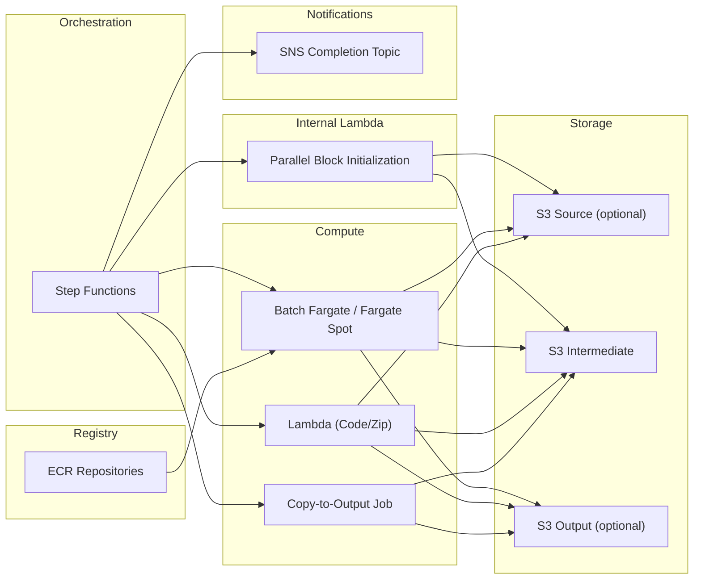

<!-- Copyright Amazon.com, Inc. or its affiliates. All Rights Reserved. SPDX-License-Identifier: MIT-0 -->

# Pipeline module

Creates data processing pipelines using AWS Step Functions, AWS Batch, AWS Lambda, and SNS. Pipelines are defined in a single YAML file that describes the steps, their configuration, and how data flows between them.

## Table of contents

- [Capabilities](#capabilities)
- [Related documentation](#related-documentation)
- [Architecture](#architecture)
- [Infrastructure & supporting resources](#infrastructure--supporting-resources)
- [Pipeline definition (YAML)](#pipeline-definition-yaml)
- [Structured logging & log aggregation](#structured-logging--log-aggregation)
- [Usage](#usage)
- [Custom input modes](#custom-input-modes)
- [Environment variables available to steps](#environment-variables-available-to-steps)
- [Execution](#execution)
- [Step configuration](#step-configuration)
- [Step types](#step-types)
  - [Batch step](#batch-step)
  - [Lambda step](#lambda-step)
  - [Parallel step](#parallel-step)
- [Environment variables (summary)](#environment-variables)
- [Examples](#examples)
- [OpenTofu usage](#opentofu-usage)

## Capabilities

- **Sequential and parallel execution** — steps run in order; one step can fan out over an array to process items concurrently
- **Multiple compute backends** — batch steps run containers on Fargate (on-demand or Spot); lambda steps run Python functions with up to 10 GB memory and 15 min timeout
- **Automatic data flow** — each step's output is stored in S3 and automatically passed to subsequent steps; no manual wiring needed
- **S3 directory discovery** — automatically discover and iterate over subdirectories in S3, enabling dynamic fan-out without hardcoding paths
- **Runtime parameter override** — define deploy-time defaults in YAML, override them per-execution without redeploying
- **Secrets management** — SSM Parameters and Secrets Manager integration with automatic IAM permissions
- **Cost optimization** — Fargate Spot support (AWS advertises Fargate Spot at [up to 70% off the Fargate price](https://aws.amazon.com/fargate/pricing/)), configurable concurrency limits
- **Observability** — structured logging (Powertools), distributed tracing (ADOT), CloudWatch Logs with configurable retention
- **Output collection** — automatically copy selected step outputs to a dedicated output bucket

## Related documentation

> [!TIP]
> The **[step input reference](step_functions/README.md)** is essential reading for step developers. It documents exactly what each step type receives at runtime: payload fields, environment variables, previous step results, execution input, MAP_ITEM for parallel blocks, and the runtime parameter override pattern.

- **[Step Functions — step input reference](step_functions/README.md)** — the full contract between the orchestrator and your step code.
- **[Pipeline Lambda functions](lambdas/README.md)** — the internal Parallel Block Initialization Lambda that supports pipeline orchestration.

## Architecture




## Infrastructure & supporting resources

This section covers the shared infrastructure provisioned alongside the pipeline: storage, secrets, compute capacity, and observability.

### S3 bucket configuration

Buckets are managed by the `pipeline-initialization` module and passed via the `initialization` variable:

- **`intermediate`** (always required): Intermediate processing data between steps.
- **`source`** (optional): Input data. When present, S3 discovery reads from here.
- **`output`** (optional): Final output. Required when using `copy_to_target`.

### SSM parameters and secrets

Avoid storing secrets in OpenTofu variables. Use the `pipeline-initialization` module to provision SSM parameters and Secrets Manager secrets. The pipeline module automatically grants the necessary IAM permissions.

```yaml
ssm_parameters:
  - API_ENDPOINT
  - MODEL_VERSION

secrets:
  - name: DB_CONNECTION_STRING
```

Parameters are created at `/pipelines/<pipeline_name>-<env>/params/<name>`. Secrets at `/pipelines/<pipeline_name>-<env>/secrets/<name>`. Steps receive the prefix paths as `SSM_PARAMS_PREFIX` and `SECRETS_PREFIX` environment variables.

External (pre-existing) parameters and secrets can be referenced via `ssm_external_parameter_arns` and `secrets_external_arns` on the initialization module.

### Capacity provider

Two capacity providers can be referenced. Both are fully managed. Use `FARGATE` for any workload. Use `FARGATE_SPOT` for fault-tolerant workloads to reduce costs — AWS advertises Fargate Spot at [up to 70% off the Fargate price](https://aws.amazon.com/fargate/pricing/). Spot instances can be interrupted when AWS reclaims capacity, hence you need to define your strategy if this event occurs. The current strategy is to retry 3 times a failing Batch job that was stopped because of spot interruption (see `batch_steps.tf/resource "aws_batch_job_definition" "batch_jobs"`)

```yaml
capacity_provider: FARGATE_SPOT
```

### Copy to output

Mark steps with `copy_to_target: true` to automatically copy their intermediate output to the output bucket after all steps complete. Requires the `output` bucket.

### ECR lifecycle policy

Module-managed ECR repositories get an automatic lifecycle policy:

| Priority | Rule | Default |
|---------:|------|---------|
| 1 | Always keep `latest` tag | — |
| 2 | Keep N most recent tagged images | `3` |
| 3 | Expire untagged images after N days | `7` |
| 4 | Archive images not pulled in N days | `90` |

Rule 4 uses `transition` (not `expire`) — images remain retrievable at lower cost.

### Compute security groups (`sg_compute_additional`)

By default, the pipeline module creates security groups for Batch and Lambda steps with two egress rules:
1. HTTPS (443) to S3 via the S3 VPC prefix list
2. HTTPS (443) to VPC CIDR blocks (for VPC endpoints like ECR, CloudWatch, Secrets Manager)

If your pipeline steps need to reach endpoints outside the VPC (e.g., corporate intranet APIs, on-premises services via Direct Connect, or third-party services routed through a proxy), use `sg_compute_additional` to add egress rules to both the Batch and Lambda security groups:

```hcl
module "pipeline" {
  source = "../modules/pipeline"
  # ...

  sg_compute_additional = [
    {
      from_port   = 443
      to_port     = 443
      protocol    = "tcp"
      cidr_blocks = ["10.0.0.0/8"]  # Corporate intranet
    },
    {
      from_port   = 8080
      to_port     = 8080
      protocol    = "tcp"
      cidr_blocks = ["172.16.0.0/12"]  # Internal proxy
    }
  ]
}
```

Each entry creates an egress rule on both the Batch compute security group and the Lambda steps security group. The variable defaults to an empty list (no additional egress beyond S3 and VPC services).

---

## Pipeline definition (YAML)

Each pipeline is defined in a single YAML file. The schema is at `schemas/pipeline.schema.json` — use the `yaml-language-server` directive for IDE validation:

```yaml
# yaml-language-server: $schema=../../../modules/pipeline/schemas/pipeline.schema.json

pipeline_name: my-pipeline

buckets:
  - source
  - intermediate
  - output

steps:
  - name: my_step
    type: batch
    ram_mb: 2048
    vcpu: 1
```

> **⚠️ Important: Only one parallel processing step is allowed per pipeline.** The pipeline module supports a single `type: parallel` block in the `steps` list. If you need multiple fan-out stages, split them into separate pipelines or restructure your workflow so that a single parallel block handles the concurrent processing.

**You shall avoid storing secrets within OpenTofu variables.**

Secrets Manager secrets are managed by the `pipeline-initialization` module and passed to this module via the `initialization` variable. The pipeline module automatically grants `secretsmanager:GetSecretValue` and `kms:Decrypt` permissions to batch jobs.

```hcl
module "pipeline_init" {
  source = "../modules/pipeline-initialization"
  # ...
  secrets = ["db_password", "api_token"]
}

module "pipeline" {
  source = "../modules/pipeline"
  initialization = module.pipeline_init.config
  # ...
}
```

You can also reference externally managed secrets via `secrets_external_arns` on the initialization module. If those external secrets are encrypted with a customer managed KMS key, pass the key ARNs via `secrets_external_kms_key_arns`.

```hcl
module "pipeline_init" {
  source = "../modules/pipeline-initialization"
  # ...
  secrets_external_arns = [
    "arn:aws:secretsmanager:us-east-1:123456789012:secret:shared/db-creds-AbCdEf",
  ]

  secrets_external_kms_key_arns = [
    "arn:aws:kms:us-east-1:123456789012:key/abcd-1234-efgh-5678",
  ]
}

module "pipeline" {
  source = "../modules/pipeline"
  initialization = module.pipeline_init.config
  # ...
}
```

## Structured logging & log aggregation

Every log group the module creates carries the `Pipeline` and `Environment`
tags from `common_tags`, and every pipeline ships with a field-index policy
on `run_id` + `level`.

Two families of saved CloudWatch Logs Insights queries are provisioned
under the `Pipelines/<pipeline>/<env>/` namespace — per-run queries (for
when you already know which run you're investigating) and pipeline-wide
queries (for "what's going on across the pipeline?"):

**Per-run** — paste the execution id in place of `REPLACE_WITH_RUN_ID`:

- `All logs of a run` — chronologically ordered events across every pipeline log group, filtered by `run_id`
- `Errors per run` — error leaderboard by `run_id` + `step_name` (actually scans the full window, not a single run — useful as-is)
- `Tail latest events of a run` — reverse-chronological tail (Live Tail replacement)
- `Step durations of a run` — per-step wall-clock time derived from Step Functions events

**Pipeline-wide** — no placeholder to replace, just hit Run:

- `Recent errors (pipeline)` — every `level = "ERROR"` event in the window, with `run_id` + `step_name`
- `Recent runs (pipeline)` — every event in the window (all levels), newest first, with `run_id` + `step_name`
- `Runs overview` — distinct `run_id`s with event count and first/last timestamps, newest first
- `Error rate by step` — error count, event count, and error-rate % per `step_name` across all runs
- `Run durations (pipeline)` — per-execution wall-clock time derived from Step Functions `ExecutionStarted` / `ExecutionSucceeded` / `ExecutionFailed` / `ExecutionAborted` / `ExecutionTimedOut` events, slowest first

All saved queries pre-declare their `log_group_names`, which means **the
CloudWatch Logs Insights console auto-selects every relevant log group
when you open the query** — no log-group picking needed, just click Run.
The list is a OpenTofu-computed snapshot of every log group the module
owns (Step Functions, Batch, per-step Lambda, utility Lambdas); new log
groups are picked up on the next `make tofu-apply`.

For the saved queries to return useful results, step code must emit
structured logs that include `run_id` and `step_name`. The module takes care
of every environment variable the snippet below reads (`STEP_NAME`,
`OTEL_SERVICE_NAME`, `SFN_EXECUTION_ID`), so consumer code only needs to
bind them into the logger context.

### Logging recipe for step code

Lambda handler:

```python
import os
from aws_lambda_powertools import Logger

logger = Logger(service=os.environ.get("OTEL_SERVICE_NAME"))
logger.append_keys(step_name=os.environ.get("STEP_NAME", "unknown"))

@logger.inject_lambda_context
def handler(event, context):
    run_id = event.get("SFN_EXECUTION_ID")
    if run_id:
        logger.append_keys(run_id=run_id)
    logger.info("processing", extra={"items": len(event.get("items", []))})
    ...
```

Batch `main.py`:

```python
import os
from aws_lambda_powertools import Logger

logger = Logger(service=os.environ.get("OTEL_SERVICE_NAME"))
logger.append_keys(step_name=os.environ.get("STEP_NAME", "unknown"))
if os.environ.get("SFN_EXECUTION_ID"):
    logger.append_keys(run_id=os.environ["SFN_EXECUTION_ID"])

def main():
    logger.info("starting")
    ...
```

Step code in other repositories only needs `aws-lambda-powertools` as a
public dependency — no internal package is required.

### Running queries from the CLI

From the CloudWatch console, the saved queries are ready to run as-is —
their log groups are pre-selected. From the AWS CLI, you have two options
to scope a query to this pipeline:

**Option 1 — pass the exact log-group names** (the same list the saved
queries use; `terraform output` can surface it if you wire
`local.pipeline_log_group_names` into an output):

```bash
aws logs start-query \
  --log-group-names /aws/batch/<pipeline>-<env> /aws/stepfunctions/<pipeline>-<env> \
                    /aws/lambda/<pipeline>-<env>-step-<step> ... \
  --query-string 'fields @timestamp, step_name, level, message
                  | filter run_id = "<run-id>"
                  | sort @timestamp asc
                  | limit 10000' \
  --start-time $(date -u -v-1d +%s) \
  --end-time   $(date -u +%s)
```

**Option 2 — use `SOURCE logGroups(namePrefix: [...])`** to pull every
log group that belongs to the pipeline by naming convention (CLI/API only
— the console does not render `SOURCE`; max 5 prefixes):

```bash
aws logs start-query \
  --query-string 'SOURCE logGroups(namePrefix: [
                    "/aws/batch/<pipeline>",
                    "/aws/stepfunctions/<pipeline>-<env>",
                    "/aws/lambda/<pipeline>-<env>-"
                  ])
                  | fields @timestamp, step_name, level, message
                  | filter run_id = "<run-id>"
                  | sort @timestamp asc
                  | limit 10000' \
  --start-time $(date -u -v-1d +%s) \
  --end-time   $(date -u +%s)
```

> Note: CloudWatch Logs Insights does **not** support selecting log
> groups by tag in `SOURCE` — only `namePrefix`, `accountIdentifier`,
> `logGroupClass`, and `dataSource`. The `Pipeline` tag is still useful
> for cost allocation and IAM filtering, but not as a query selector.

## Usage

### Basic example

```hcl
module "pipeline_init" {
  source = "../modules/pipeline-initialization"

  pipeline_name  = "data-processing"
  environment    = "dev"
  region         = "us-east-1"
  buckets        = ["source", "intermediate", "output"]
}

module "pipeline" {
  source = "../modules/pipeline"

  vpc_id     = "vpc-12345"
  subnet_ids = ["subnet-12345", "subnet-67890"]

  initialization = module.pipeline_init.config

  lambda_steps_code_path = "${path.module}/../../code/data-processing"

  steps = [
    {
      name      = "extraction"
      type      = "batch"
      ram_mb    = 4096
      vcpu      = 2
      image_tag = "v1.0.0"
      runtime_parameters = {
        OUTPUT_FORMAT = "parquet"
      }
    },
    {
      name   = "transformation"
      type   = "batch"
      ram_mb = 2048
      vcpu   = 1
    }
  ]
}
```

### Intermediate-only example

```hcl
module "pipeline_init" {
  source = "../modules/pipeline-initialization"

  pipeline_name = "simple-processing"
  environment   = "dev"
  region        = "us-east-1"
  buckets       = ["intermediate"]
}

module "pipeline" {
  source = "../modules/pipeline"

  vpc_id     = "vpc-12345"
  subnet_ids = ["subnet-12345", "subnet-67890"]

  initialization = module.pipeline_init.config

  lambda_steps_code_path = "${path.module}/../../code/simple-processing"

  steps = [
    {
      name   = "processing"
      type   = "batch"
      ram_mb = 2048
      vcpu   = 1
    }
  ]
}
```

### Lambda step example

Lambda steps use code-based (zip) deployment and run as AWS Lambda functions. They're ideal for lighter workloads that complete within 15 minutes and don't need more than 10 GB of memory. Your step code lives in `code/<pipeline-name>/<step-name>/main.py` and must export a `handler(event, context)` function.

Powertools and ADOT layers are always included. You can attach additional layers via `lambda_layers`.

```hcl
module "pipeline" {
  source = "../modules/pipeline"

  vpc_id     = "vpc-12345"
  subnet_ids = ["subnet-12345", "subnet-67890"]

  initialization = module.pipeline_init.config

  lambda_steps_code_path = "${path.module}/../../code/data-processing"

  steps = [
    {
      name               = "lightweight-transform"
      type               = "lambda"
      lambda_timeout     = 300
      lambda_memory_size = 1024
      lambda_layers = [
        "arn:aws:lambda:us-east-1:123456789012:layer:my-shared-lib:3"
      ]
      runtime_parameters = {
        OUTPUT_FORMAT = "parquet"
      }
    },
    {
      name   = "heavy-processing"
      type   = "batch"
      ram_mb = 8192
      vcpu   = 4
    }
  ]
}
```

Lambda steps receive runtime parameters as Lambda environment variables (same as batch steps). Dynamic values (`SFN_EXECUTION_ID`, `STEP_*`, `EXECUTION_INPUT`) come via the `event` payload. Static config (`STEP_NAME`, `SOURCE_BUCKET`, `INTERMEDIATE_BUCKET`, etc.) is available via `os.environ`.

### Runtime parameter precedence

Runtime parameter values defined in the pipeline YAML are set as deploy-time defaults (Lambda env vars / Batch job definition). The full execution input is also passed to every step as `EXECUTION_INPUT`, allowing step code to implement an override pattern. See the [step input reference](step_functions/README.md#runtime-parameters) for details and code examples.

## Resource naming

All module-created resources follow the pattern:

```
<pipeline_name>-<environment>-<resource_key>
```

This allows the same pipeline to be deployed to multiple environments (`dev`, `staging`, `prod`) within the same AWS account without collisions, and makes it easy to identify the owner of a resource at a glance.

| Resource | Name pattern |
|----------|--------------|
| S3 buckets (from `pipeline-initialization`) | `<pipeline_name>-<environment>-<bucket>-<account_id>` |
| KMS alias (ECR) | `alias/ecr-<pipeline_name>-<environment>` |
| ECR repositories (batch steps) | `<pipeline_name>-<environment>-<step_name>` |
| Batch compute environment | `<pipeline_name>-<environment>-<capacity_provider>` |
| Batch job queue | `<pipeline_name>-<environment>` |
| Batch job definitions (batch steps) | `<pipeline_name>-<environment>-<step_name>` |
| Batch job definition (copy to target) | `<pipeline_name>-<environment>-copy-to-target` |
| CloudWatch log group (Batch) | `/aws/batch/<pipeline_name>-<environment>` |
| CloudWatch log group (Lambda steps) | `/aws/lambda/<pipeline_name>-<environment>-step-<step_name>` |
| CloudWatch log group (Step Functions) | `/aws/stepfunctions/<pipeline_name>-<environment>` |
| Lambda functions (internal) | `<pipeline_name>-<environment>-<lambda_key>` |
| Lambda functions (lambda steps) | `<pipeline_name>-<environment>-step-<step_name>` |
| IAM roles and policies | `<pipeline_name>-<environment>-<role_key>` |
| Security groups (compute / lambda steps) | `<pipeline_name>-<environment>-<sg_key>-` (name_prefix) |
| SNS topic (pipeline completion) | `<pipeline_name>-<environment>-completion` |
| SQS DLQ (Lambda internal) | `<pipeline_name>-<environment>-<lambda_key>-dlq` |
| Step Functions state machine | `<pipeline_name>-<environment>` |

## Custom input modes

When the parallel block uses `input.type: custom`, the execution payload passes an explicit list of values directly to the parallel iterations. The values can be anything — S3 paths, URLs, database URIs, arbitrary identifiers. The Parallel Block Initialization Lambda performs a simple passthrough.

S3 paths:

```json
{
  "inputs": {
    "type": "custom",
    "value": [
      "path/to/dir1/",
      "path/to/dir2/"
    ]
  }
}
```

URLs or external endpoints:

```json
{
  "inputs": {
    "type": "custom",
    "value": [
      "https://api.example.com/dataset/1",
      "https://api.example.com/dataset/2"
    ]
  }
}
```

Arbitrary identifiers:

```json
{
  "inputs": {
    "type": "custom",
    "value": [
      "customer-segment-A",
      "customer-segment-B"
    ]
  }
}
```

Each value in the list becomes the `MAP_ITEM` for one parallel iteration. Your step code decides how to interpret it.

> Note: When using `custom` mode, no S3 bucket resolution is performed. If a single value is provided instead of a list, it is automatically wrapped in a list.

### Runtime parameters

Runtime parameters are **deploy-time environment variables** defined in the pipeline YAML:

```yaml
- name: ingest
  type: batch
  runtime_parameters:
    SOURCE_SYSTEM: "sensor-array-north"
    OUTPUT_FORMAT: "parquet"
```

At deploy time, these key-value pairs are set as static environment variables on the Batch job definition or Lambda function. They are **not** derived from the execution payload.

However, every step also receives the full execution input as `EXECUTION_INPUT`. Step code can implement an override pattern — check `EXECUTION_INPUT` first, then fall back to the deploy-time default:

```python
import json, os

exec_input = json.loads(os.environ.get("EXECUTION_INPUT", "{}"))
source_system = exec_input.get("SOURCE_SYSTEM", os.environ.get("SOURCE_SYSTEM", ""))
```

This gives a two-layer system:
1. **Deploy-time default** — from `runtime_parameters` in the YAML
2. **Execution-time override** — from the Step Functions execution payload (optional, code-driven)

> For the full specification of what each step type receives at runtime (payload fields, environment variables, JSON serialization), see the [step input reference](step_functions/README.md#runtime-parameters).

### How it all fits together

1. You start the Step Function with a JSON payload containing `inputs` (and optionally top-level keys your code can use as overrides)
2. The `inputs` object is passed to the Parallel Block Initialization Lambda
3. The Lambda resolves it into a list of source paths (S3 discovery) or passes values through (custom)
4. The Step Function iterates over the list, running each pipeline step for each element in the parallel block
5. Each step receives bucket names, execution ID, previous step results, and runtime parameters as environment variables (batch) or payload fields (lambda)

## Environment variables available to steps

### Static (set at deploy time via OpenTofu)

- `STEP_NAME`: Name of the current pipeline step
- `SOURCE_BUCKET`: Source data S3 bucket name (only when source bucket is configured)
- `INTERMEDIATE_BUCKET`: Intermediate data S3 bucket name
- `OUTPUT_BUCKET`: Output data S3 bucket name (only when output bucket is configured)
- `SSM_PARAMS_PREFIX`: SSM parameter path prefix (e.g. `/pipelines/<name>-<env>/params`), only set when SSM parameters are configured
- `SECRETS_PREFIX`: Secrets Manager path prefix (e.g. `/pipelines/<name>-<env>/secrets`), only set when secrets are configured
- Runtime parameter values from the pipeline YAML (deploy-time defaults)

### Dynamic (set at runtime via Step Functions)

- `SFN_EXECUTION_ID`: Step Functions execution name
- `STEP_<NAME>`: Output from each preceding step (JSON-serialized for batch, direct for lambda)
- `MAP_ITEM`: Current array element (inside parallel blocks only)
- `EXECUTION_INPUT`: Full execution payload (JSON-serialized for batch, dict for lambda)

For batch steps, all dynamic values are container environment variables (JSON-serialized strings — use `json.loads()`). For lambda steps, static values are in `os.environ` and dynamic values are in the `event` payload.

> For the full reference including code examples and serialization details, see the [step input reference](step_functions/README.md).

### Using external ECR repository

```hcl
steps = [
  {
    name               = "extraction"
    type               = "batch"
    ecr_repository_url = "123456789012.dkr.ecr.us-east-1.amazonaws.com/shared-repo"
    image_tag          = "v1.0.0"
  }
]
```

### Copying data to output bucket

To automatically copy processed data from intermediate storage to the output bucket, mark steps with `copy_to_target: true`:

```hcl
steps = [
  {
    name           = "data-processing"
    type           = "batch"
    copy_to_target = true  # Mark this step's output for copying
  },
  {
    name           = "generate-report"
    type           = "lambda"
    copy_to_target = true
  }
]
```

The pipeline module will:
1. Automatically add a `Copy-To-Output` step after all steps complete
2. Sync data from `s3://intermediate-bucket/{execution-id}/{step-name}/` to `s3://output-bucket/{execution-id}/{step-name}/`
3. Use the shared `copy-intermediate-to-output` container from the central ECR

Configure the ECR URL in your pipeline:

```hcl
module "pipeline" {
  source = "..."

  copy_to_target_ecr_url = "${account_id}.dkr.ecr.${region}.amazonaws.com/shared-copy-intermediate-to-output"

  steps = [...]
}
```

> Pay Attention: if one of the variables `copy_to_target_ecr_url`, `copy_to_target`, or the `output` bucket is not configured,
> OpenTofu will not fail but the copy to output job will not be deployed.

## Execution

Start pipeline with S3 discovery (parallel block as first step):

```json
{
  "inputs": {
    "type": "s3",
    "root_prefix": "upload1/"
  }
}
```

With a custom list of S3 directories:

```json
{
  "inputs": {
    "type": "custom",
    "value": ["dir1/", "dir2/"]
  }
}
```

With a custom list of non-S3 values (URLs, identifiers, etc.):

```json
{
  "inputs": {
    "type": "custom",
    "value": ["https://api.example.com/data/1", "https://api.example.com/data/2"]
  }
}
```

## Step configuration
### Top-level fields

| Field | Type | Required | Default | Description |
|-------|------|----------|---------|-------------|
| `pipeline_name` | string | Yes | — | Unique pipeline identifier. Used in resource naming. |
| `buckets` | list | No | `[intermediate]` | S3 bucket types to create: `source`, `intermediate`, `output`. |
| `tags` | map | No | `{}` | Tags applied to all pipeline resources. |
| `pipeline_completion_emails` | list | No | `[]` | Email addresses notified on pipeline completion. |
| `capacity_provider` | string | No | `FARGATE` | `FARGATE` (on-demand) or `FARGATE_SPOT` ([up to 70% off the Fargate price](https://aws.amazon.com/fargate/pricing/)). |
| `max_concurrency` | number | No | `0` | Max parallel Map iterations. `0` = unlimited. |
| `cw_retention_days` | number | No | `365` | CloudWatch Logs retention in days. Must be between `15` and `730` (enforced by both `check-jsonschema` and `tofu apply`). |
| `ssm_parameters` | list | No | `[]` | SSM parameter names to create as placeholders. |
| `secrets` | list | No | `[]` | Secrets Manager secrets to create. Each item: `{name: "..."}`. |

## Step types

The `steps` list defines the pipeline execution order. Steps run sequentially. One step may be a `parallel` block that fans out over an array.

### Batch step

Runs a containerized job on AWS Batch (Fargate). Your code lives in a Docker image pushed to ECR.

```yaml
- name: ingest_raw_data
  type: batch
  ram_mb: 4096
  vcpu: 2
  image_tag: v1.2.0
  runtime_parameters:
    SOURCE_SYSTEM: "sensor-array-north"
    INGESTION_MODE: "full"
  copy_to_target: true
```

| Field | Type | Default | Description |
|-------|------|---------|-------------|
| `name` | string | — | Step identifier (alphanumeric + underscores). |
| `type` | `"batch"` | — | |
| `ram_mb` | number | `2048` | Memory in MB. |
| `vcpu` | number | `1` | vCPU count. |
| `image_tag` | string | `"latest"` | Docker image tag. |
| `ecr_repository_url` | string | `null` | External ECR URL. Omit to auto-create a repository. |
| `runtime_parameters` | map | `{}` | Key-value pairs set as container environment variables. |
| `copy_to_target` | bool | `false` | Copy this step's output to the output bucket after completion. |

### Lambda step

Runs an AWS Lambda function. Code lives in `code/<pipeline_name>/<step_name>/main.py` and must export a `handler(event, context)` function. Powertools and ADOT layers are always included.

```yaml
- name: validate_ingestion
  type: lambda
  lambda_timeout: 300
  lambda_memory_size: 1024
  lambda_ephemeral_storage: 1024
  lambda_layers:
    - arn:aws:lambda:us-east-1:123456789012:layer:my-lib:3
  runtime_parameters:
    VALIDATION_PROFILE: "strict"
```

| Field | Type | Default | Description |
|-------|------|---------|-------------|
| `name` | string | — | Step identifier. |
| `type` | `"lambda"` | — | |
| `lambda_timeout` | number | `900` | Timeout in seconds (max 900). |
| `lambda_memory_size` | number | `2048` | Memory in MB (max 10240). |
| `lambda_ephemeral_storage` | number | `512` | Ephemeral storage in MB (max 10240). |
| `lambda_layers` | list | `[]` | Additional Lambda layer ARNs. |
| `runtime_parameters` | map | `{}` | Key-value pairs set as Lambda environment variables. |

### Parallel step

Fans out over an array, running inner steps concurrently for each element. Only one parallel block is allowed per pipeline. Inner steps can be `batch` or `lambda`.

| Field | Type | Description |
|-------|------|-------------|
| `name` | string | Step identifier. |
| `type` | `"parallel"` | |
| `input` | object | How the fan-out array is resolved (see modes below). |
| `parallel_steps` | list | Batch or lambda steps to run inside the Map. |

The `input` object determines what the parallel block iterates over. There are several distinct modes depending on `input.type`, `from_step`, and the pipeline position.

---

#### Mode 1: S3 discovery — first step in pipeline

When the parallel block is the **first step** (no preceding compute steps), it discovers directories on the **source bucket**. The `root_prefix` comes from the execution payload at runtime.

```yaml
steps:
  - name: fan_out
    type: parallel
    input:
      type: s3
    parallel_steps:
      - name: process_item
        type: lambda
```

Execution payload:
```json
{ "inputs": { "type": "s3", "root_prefix": "upload1/" } }
```

Discovery target: `s3://<source_bucket>/upload1/` → finds `upload1/session-a/`, `upload1/session-b/`, etc.

---

#### Mode 2: S3 discovery — after a preceding compute step (implicit)

When there is a preceding compute step but **no `from_step`** is specified, the parallel block automatically discovers directories under the **last preceding compute step's output** in the intermediate bucket.

```yaml
steps:
  - name: prepare_data
    type: lambda

  - name: fan_out
    type: parallel
    input:
      type: s3
    parallel_steps:
      - name: process_item
        type: lambda
```

Discovery target: `s3://<intermediate_bucket>/<exec_id>/prepare_data/` → finds `<exec_id>/prepare_data/batch-a/`, `<exec_id>/prepare_data/batch-b/`, etc.

No configuration needed — the module infers the previous step automatically.

---

#### Mode 3: S3 discovery — explicit `from_step`

Use `from_step` to explicitly target a specific preceding step's output for discovery, even if it's not the immediately preceding step.

```yaml
steps:
  - name: prepare_data
    type: lambda

  - name: discover_sources
    type: lambda

  - name: fan_out
    type: parallel
    input:
      type: s3
      from_step: prepare_data
    parallel_steps:
      - name: process_item
        type: lambda
```

Discovery target: `s3://<intermediate_bucket>/<exec_id>/prepare_data/` (skips `discover_sources`).

---

#### Mode 4: S3 discovery — `from_step` with `root_prefix`

When `from_step` is combined with `root_prefix`, the prefix is appended **within** the from_step's output directory. This targets a specific subdirectory of a step's output.

```yaml
steps:
  - name: prepare_data
    type: lambda

  - name: fan_out
    type: parallel
    input:
      type: s3
      from_step: prepare_data
      root_prefix: validated
    parallel_steps:
      - name: process_item
        type: lambda
```

Discovery target: `s3://<intermediate_bucket>/<exec_id>/prepare_data/validated/`

Use case: `prepare_data` writes to both `validated/` and `rejected/` subdirectories, and you only want to fan out over the validated data.

---

#### Mode 5: Custom values — from execution payload

Pass an explicit list of values directly from the execution payload. Values can be anything — S3 paths, URLs, identifiers.

```yaml
steps:
  - name: fan_out
    type: parallel
    input:
      type: custom
    parallel_steps:
      - name: process_item
        type: batch
```

Execution payload:
```json
{
  "inputs": {
    "type": "custom",
    "value": ["https://api.example.com/dataset/1", "customer-segment-A", "s3://bucket/path/"]
  }
}
```

Each value becomes the `MAP_ITEM` for one parallel iteration. Your step code decides how to interpret it.

---

#### Mode 6: Custom values — from a preceding step's output

Use `from_step` + `field` to read a list from a preceding Lambda step's return value. The `field` supports dot-notation for nested objects.

```yaml
steps:
  - name: split_workload
    type: lambda

  - name: fan_out
    type: parallel
    input:
      type: custom
      from_step: split_workload
      field: chunks
    parallel_steps:
      - name: transform_chunk
        type: batch
        ram_mb: 8192
        vcpu: 4
```

If `split_workload` returns `{"chunks": ["chunk-1", "chunk-2", "chunk-3"]}`, the parallel block iterates over those three values.

For nested fields, use dot-notation: `field: result.paths_after_lambda` reads from `{"result": {"paths_after_lambda": [...]}}`.

---

#### S3 discovery resolution summary

| Scenario | Bucket | Prefix |
|---|---|---|
| First step, no `from_step` | Source | `root_prefix` from execution payload |
| Previous compute step exists, no `from_step` | Intermediate | `<exec_id>/<previous_step>/` |
| `from_step` set, no `root_prefix` | Intermediate | `<exec_id>/<from_step>/` |
| `from_step` set, with `root_prefix` | Intermediate | `<exec_id>/<from_step>/<root_prefix>/` |

For full details on what each step receives at runtime inside the parallel block, see the [Step Input Reference](step_functions/README.md).


## Environment variables

Steps receive both static (deploy-time) and dynamic (runtime) variables. A summary:

| Variable | Source | Available In |
|---|---|---|
| `STEP_NAME` | OpenTofu | `os.environ` |
| `SOURCE_BUCKET` | OpenTofu | `os.environ` (if configured) |
| `INTERMEDIATE_BUCKET` | OpenTofu | `os.environ` |
| `OUTPUT_BUCKET` | OpenTofu | `os.environ` (if configured) |
| `SFN_EXECUTION_ID` | Step Functions | event (lambda) / `os.environ` (batch) |
| `MAP_ITEM` | Step Functions | event / `os.environ` (inside parallel only) |
| `STEP_<NAME>` | Step Functions | Preceding step results (auto-generated) |
| `EXECUTION_INPUT` | Step Functions | Full execution payload |

For the complete reference including JSON paths, serialization details, and code examples, see the [Step Input Reference](step_functions/README.md).

## Examples

### Simple batch pipeline

```yaml
pipeline_name: data-processing

buckets:
  - source
  - intermediate
  - output

capacity_provider: FARGATE_SPOT

steps:
  - name: extraction
    type: batch
    ram_mb: 4096
    vcpu: 2
    image_tag: v1.0.0
    runtime_parameters:
      OUTPUT_FORMAT: "parquet"

  - name: transformation
    type: batch
    ram_mb: 2048
    vcpu: 1
    copy_to_target: true
```

### Lambda + parallel fan-out (custom from step)

```yaml
pipeline_name: agentic-processing

buckets:
  - source
  - intermediate
  - output

steps:
  - name: lambda_step
    type: lambda
    lambda_timeout: 300
    lambda_memory_size: 1024
    runtime_parameters:
      API_BASE_URL: "https://api.example.com"

  - name: process_in_parallel
    type: parallel
    input:
      type: custom
      from_step: lambda_step
      field: result.paths
    parallel_steps:
      - name: process_single_source
        type: lambda
        lambda_timeout: 300

  - name: aggregate
    type: batch
    ram_mb: 2048
    vcpu: 1
    copy_to_target: true
```

### S3 discovery with from_step

```yaml
pipeline_name: s3-parallel-from-step

buckets:
  - intermediate

steps:
  - name: prepare_data
    type: lambda
    lambda_timeout: 60

  - name: fan_out
    type: parallel
    input:
      type: s3
      from_step: prepare_data
    parallel_steps:
      - name: process_item
        type: lambda
        lambda_timeout: 60
```

The parallel block discovers directories under `<exec_id>/prepare_data/` in the intermediate bucket.

> **Note:** here `prepare_data` is the immediately preceding step, so `from_step` is explicit but not strictly required (the implicit mode would resolve to the same prefix). `from_step` becomes useful when you insert one or more steps between `prepare_data` and the parallel block — for example a `discover_sources` step that inspects or catalogs what `prepare_data` wrote, for better data management. In that case `from_step: prepare_data` keeps the fan-out anchored on `prepare_data`'s output and skips the intermediate step. The real `s3-parallel-from-step` integration test pipeline includes such a `discover_sources` step to exercise this; it is optional and you can omit it as shown above.

To target a subdirectory within that step's output, add `root_prefix`:

```yaml
    input:
      type: s3
      from_step: prepare_data
      root_prefix: validated
```

This discovers under `<exec_id>/prepare_data/validated/` instead.

### Full-featured pipeline

```yaml
pipeline_name: complex-pipeline

buckets:
  - source
  - intermediate
  - output

tags:
  UseCase: complex-pipeline
  Team: platform

pipeline_completion_emails:
  - team@example.com

max_concurrency: 10
capacity_provider: FARGATE
cw_retention_days: 365

ssm_parameters:
  - API_ENDPOINT
  - MODEL_VERSION

secrets:
  - name: DB_CONNECTION_STRING
  - name: EXTERNAL_API_KEY

steps:
  - name: ingest_raw_data
    type: batch
    ram_mb: 4096
    vcpu: 2
    runtime_parameters:
      SOURCE_SYSTEM: "source_system"

  - name: validate_ingestion
    type: lambda
    lambda_timeout: 300
    lambda_memory_size: 1024
    lambda_ephemeral_storage: 1024
    runtime_parameters:
      VALIDATION_PROFILE: "strict"

  - name: split_workload
    type: lambda
    lambda_timeout: 600
    lambda_memory_size: 2048

  - name: fan_out_processing
    type: parallel
    input:
      type: custom
      from_step: split_workload
      field: chunks
    parallel_steps:
      - name: transform_chunk
        type: batch
        ram_mb: 8192
        vcpu: 4
        runtime_parameters:
          TRANSFORM_CONFIG: "default"
      - name: score_chunk
        type: lambda
        lambda_timeout: 900
        lambda_memory_size: 3008

  - name: aggregate_results
    type: batch
    ram_mb: 4096
    vcpu: 2
    copy_to_target: true

  - name: publish_report
    type: lambda
    lambda_timeout: 120
    lambda_memory_size: 512
```

## OpenTofu usage

```hcl
module "pipeline_init" {
  source = "../modules/pipeline-initialization"

  pipeline_name = "data-processing"
  environment   = "dev"
  region        = "us-east-1"
  buckets       = ["source", "intermediate", "output"]

  ssm_parameters = ["API_ENDPOINT"]
  secrets        = [{ name = "DB_CONNECTION_STRING" }]
}

module "pipeline" {
  source = "../modules/pipeline"

  initialization = module.pipeline_init.config

  vpc_id     = "vpc-12345"
  subnet_ids = ["subnet-12345", "subnet-67890"]

  capacity_provider      = "FARGATE_SPOT"
  max_concurrency        = 10
  lambda_steps_code_path = "${path.module}/../../code/data-processing"

  steps = yamldecode(file("pipeline.yaml")).steps

  sg_compute_additional = [
    {
      from_port   = 443
      to_port     = 443
      protocol    = "tcp"
      cidr_blocks = ["10.0.0.0/8"]
    }
  ]
}
```

<!-- BEGIN_TF_DOCS -->


## Requirements

| Name | Version |
|------|---------|
| <a name="requirement_terraform"></a> [terraform](#requirement\_terraform) | >= 1.8 |
| <a name="requirement_archive"></a> [archive](#requirement\_archive) | ~> 2.7 |
| <a name="requirement_aws"></a> [aws](#requirement\_aws) | ~> 6.0 |

## Providers

| Name | Version |
|------|---------|
| <a name="provider_archive"></a> [archive](#provider\_archive) | ~> 2.7 |
| <a name="provider_aws"></a> [aws](#provider\_aws) | ~> 6.0 |

## Modules

No modules.

## Resources

| Name | Type |
|------|------|
| aws_batch_compute_environment.pipeline | resource |
| aws_batch_job_definition.batch_jobs | resource |
| aws_batch_job_definition.copy_to_target | resource |
| aws_batch_job_queue.pipeline | resource |
| aws_cloudwatch_log_group.batch | resource |
| aws_cloudwatch_log_group.lambda_steps | resource |
| aws_cloudwatch_log_group.pipeline_lambda | resource |
| aws_cloudwatch_log_group.step_functions | resource |
| aws_cloudwatch_log_index_policy.pipeline | resource |
| aws_cloudwatch_query_definition.all_logs_of_run | resource |
| aws_cloudwatch_query_definition.error_rate_by_step | resource |
| aws_cloudwatch_query_definition.errors_by_run | resource |
| aws_cloudwatch_query_definition.recent_errors | resource |
| aws_cloudwatch_query_definition.recent_runs | resource |
| aws_cloudwatch_query_definition.run_durations | resource |
| aws_cloudwatch_query_definition.runs_overview | resource |
| aws_cloudwatch_query_definition.step_durations | resource |
| aws_cloudwatch_query_definition.tail_run | resource |
| aws_ecr_lifecycle_policy.batch_repos | resource |
| aws_ecr_repository.batch_repos | resource |
| aws_iam_role.batch_execution | resource |
| aws_iam_role.batch_task | resource |
| aws_iam_role.lambda_execution | resource |
| aws_iam_role.lambda_step_execution | resource |
| aws_iam_role.step_functions | resource |
| aws_iam_role_policy.batch_execution_logs | resource |
| aws_iam_role_policy.batch_s3_access | resource |
| aws_iam_role_policy.batch_task_secrets | resource |
| aws_iam_role_policy.batch_task_ssm | resource |
| aws_iam_role_policy.lambda_step_dlq | resource |
| aws_iam_role_policy.lambda_step_s3_access | resource |
| aws_iam_role_policy.lambda_step_secrets | resource |
| aws_iam_role_policy.lambda_step_ssm | resource |
| aws_iam_role_policy.parallel_block_initialization_lambda_s3 | resource |
| aws_iam_role_policy.step_functions_batch | resource |
| aws_iam_role_policy.step_functions_secrets | resource |
| aws_iam_role_policy_attachment.batch_execution | resource |
| aws_iam_role_policy_attachment.lambda_basic | resource |
| aws_iam_role_policy_attachment.lambda_step_basic | resource |
| aws_iam_role_policy_attachment.lambda_step_vpc | resource |
| aws_iam_role_policy_attachment.lambda_step_xray | resource |
| aws_iam_role_policy_attachment.lambda_xray | resource |
| aws_kms_alias.ecr | resource |
| aws_kms_key.ecr | resource |
| aws_lambda_function.lambda_steps | resource |
| aws_lambda_function.pipeline_lambda | resource |
| aws_security_group.batch_steps | resource |
| aws_security_group.lambda_steps | resource |
| aws_sfn_state_machine.pipeline | resource |
| aws_sns_topic.pipeline_completion | resource |
| aws_sns_topic_subscription.pipeline_completion_emails | resource |
| aws_sqs_queue.lambda_dlq | resource |
| aws_sqs_queue.lambda_steps_dlq | resource |
| archive_file.lambda_step_zip | data source |
| archive_file.lambda_zip | data source |
| aws_caller_identity.current | data source |
| aws_iam_policy_document.batch_execution_assume_role | data source |
| aws_iam_policy_document.batch_execution_logs | data source |
| aws_iam_policy_document.batch_s3_access | data source |
| aws_iam_policy_document.batch_task_assume_role | data source |
| aws_iam_policy_document.batch_task_secrets | data source |
| aws_iam_policy_document.batch_task_ssm | data source |
| aws_iam_policy_document.kms_key | data source |
| aws_iam_policy_document.lambda_assume_role | data source |
| aws_iam_policy_document.lambda_step_assume_role | data source |
| aws_iam_policy_document.lambda_step_dlq | data source |
| aws_iam_policy_document.lambda_step_s3_access | data source |
| aws_iam_policy_document.lambda_step_secrets | data source |
| aws_iam_policy_document.lambda_step_ssm | data source |
| aws_iam_policy_document.parallel_block_initialization | data source |
| aws_iam_policy_document.step_functions_assume_role | data source |
| aws_iam_policy_document.step_functions_batch | data source |
| aws_iam_policy_document.step_functions_secrets | data source |
| aws_prefix_list.s3 | data source |
| aws_region.current | data source |
| aws_s3_bucket.intermediate | data source |
| aws_s3_bucket.output | data source |
| aws_s3_bucket.source | data source |
| aws_ssm_parameter.powertools | data source |
| aws_vpc.selected | data source |

## Inputs

| Name | Description | Type | Default | Required |
|------|-------------|------|---------|:--------:|
| <a name="input_additional_tags"></a> [additional\_tags](#input\_additional\_tags) | Additional Tags | `map(string)` | `{}` | no |
| <a name="input_capacity_provider"></a> [capacity\_provider](#input\_capacity\_provider) | Capacity provider for AWS Batch compute environment. Use 'FARGATE' for on-demand or 'FARGATE\_SPOT' for cost-optimized spot instances. | `string` | `"FARGATE"` | no |
| <a name="input_copy_to_target_ecr_url"></a> [copy\_to\_target\_ecr\_url](#input\_copy\_to\_target\_ecr\_url) | ECR URL for the copy-intermediate-to-output container | `string` | `""` | no |
| <a name="input_cw_retention_days"></a> [cw\_retention\_days](#input\_cw\_retention\_days) | Shared value for CloudWatch Logs retention days (validated to be between 15 and 730) | `number` | `365` | no |
| <a name="input_ecr_archive_unpulled_days"></a> [ecr\_archive\_unpulled\_days](#input\_ecr\_archive\_unpulled\_days) | Transition ECR images to archive storage when not pulled for this many days (sinceImagePulled). Images stay retrievable but at lower cost. Set to null to disable. | `number` | `90` | no |
| <a name="input_ecr_expire_untagged_days"></a> [ecr\_expire\_untagged\_days](#input\_ecr\_expire\_untagged\_days) | Expire untagged ECR images after this many days. Set to null to disable the rule. | `number` | `7` | no |
| <a name="input_ecr_force_delete"></a> [ecr\_force\_delete](#input\_ecr\_force\_delete) | ECR Delete even if images are present | `bool` | `true` | no |
| <a name="input_ecr_keep_tagged_count"></a> [ecr\_keep\_tagged\_count](#input\_ecr\_keep\_tagged\_count) | Keep the N most recently pushed tagged images (any tag). The image tagged exactly 'latest' is always retained in addition to this. Set to null to disable the rule. | `number` | `3` | no |
| <a name="input_ecr_scan_on_push"></a> [ecr\_scan\_on\_push](#input\_ecr\_scan\_on\_push) | Enable Amazon ECR basic scanning on image push for batch step repositories. | `bool` | `true` | no |
| <a name="input_initialization"></a> [initialization](#input\_initialization) | Configuration object from the pipeline-initialization module. Contains shared context (pipeline\_name, environment, region, tags), bucket names/KMS key, SSM and Secrets Manager configuration. | <pre>object({<br/>    pipeline_name = string<br/>    environment   = string<br/>    region        = string<br/>    tags          = optional(map(string), {})<br/><br/>    buckets = object({<br/>      names   = map(string)<br/>      kms_key = string<br/>    })<br/>    cloudwatch = optional(object({<br/>      kms_key = string<br/>    }), { kms_key = null })<br/>    ssm = optional(object({<br/>      prefix            = optional(string)<br/>      kms_key           = optional(string)<br/>      arns              = optional(map(string), {})<br/>      external_arns     = optional(list(string), [])<br/>      external_kms_keys = optional(list(string), [])<br/>    }), { prefix = null, kms_key = null, arns = {}, external_arns = [], external_kms_keys = [] })<br/>    secrets = optional(object({<br/>      prefix            = optional(string)<br/>      kms_key           = optional(string)<br/>      arns              = optional(map(string), {})<br/>      external_arns     = optional(list(string), [])<br/>      external_kms_keys = optional(list(string), [])<br/>    }), { prefix = null, kms_key = null, arns = {}, external_arns = [], external_kms_keys = [] })<br/>  })</pre> | n/a | yes |
| <a name="input_lambda_steps_code_path"></a> [lambda\_steps\_code\_path](#input\_lambda\_steps\_code\_path) | Absolute path to the directory containing lambda step subdirectories. Each step expects a folder named after the step (e.g. <path>/<step\_name>/main.py). Callers must pass an absolute path using path.module from their root module. | `string` | n/a | yes |
| <a name="input_max_concurrency"></a> [max\_concurrency](#input\_max\_concurrency) | Maximum concurrency for the parallel Map step | `number` | `0` | no |
| <a name="input_max_vcpus"></a> [max\_vcpus](#input\_max\_vcpus) | AWS Batch maximum vcpus for across all the running jobs | `number` | `256` | no |
| <a name="input_pipeline_completion_emails"></a> [pipeline\_completion\_emails](#input\_pipeline\_completion\_emails) | List of email addresses to subscribe to the pipeline completion SNS topic | `list(string)` | `[]` | no |
| <a name="input_sg_compute_additional"></a> [sg\_compute\_additional](#input\_sg\_compute\_additional) | Additional egress rules for compute security groups | <pre>list(object({<br/>    from_port   = number<br/>    to_port     = number<br/>    protocol    = string<br/>    cidr_blocks = list(string)<br/>  }))</pre> | `[]` | no |
| <a name="input_steps"></a> [steps](#input\_steps) | Ordered list of pipeline steps. Steps run sequentially in the order defined.<br/>One entry may use type="parallel" to define a Map block that fans out over the<br/>output array of the preceding step.<br/><br/>Regular step types: "batch", "lambda"<br/>Special type: "parallel" — contains a nested `parallel_steps` list of compute<br/>steps that run inside a Step Functions Map state.<br/><br/>Every compute step automatically stores its result at $.<step\_name>\_result<br/>in the state. The parallel block uses `items_path` to reference the array<br/>from a previous step's result. Inside the Map, each iteration receives the<br/>array element as the MAP\_ITEM env var (lambda payload) or environment<br/>variable (batch). | <pre>list(object({<br/>    name = string<br/>    type = string # "batch", "lambda", or "parallel"<br/><br/>    # Batch step configuration<br/>    ram_mb             = optional(number, 2048)<br/>    vcpu               = optional(number, 1)<br/>    image_tag          = optional(string, "latest")<br/>    ecr_repository_url = optional(string, null)<br/>    runtime_parameters = optional(map(string), {})<br/>    copy_to_target     = optional(bool, false)<br/><br/>    # Lambda step configuration<br/>    lambda_timeout           = optional(number, 900)<br/>    lambda_memory_size       = optional(number, 2048)<br/>    lambda_ephemeral_storage = optional(number, 512)<br/>    lambda_layers            = optional(list(string), [])<br/><br/>    # Parallel block configuration (only when type = "parallel")<br/>    input = optional(object({<br/>      type        = string                 # "s3" or "custom"<br/>      from_step   = optional(string, null) # Name of a preceding step whose output provides the fan-out data<br/>      root_prefix = optional(string, null) # S3 prefix for discovery (type=s3 with from_step)<br/>      field       = optional(string, null) # Dot-notation field path in previous step's output (type=custom with from_step)<br/>    }), null)<br/>    parallel_steps = optional(list(object({<br/>      name                     = string<br/>      type                     = string # "batch" or "lambda"<br/>      ram_mb                   = optional(number, 2048)<br/>      vcpu                     = optional(number, 1)<br/>      image_tag                = optional(string, "latest")<br/>      ecr_repository_url       = optional(string, null)<br/>      runtime_parameters       = optional(map(string), {})<br/>      copy_to_target           = optional(bool, false)<br/>      lambda_timeout           = optional(number, 900)<br/>      lambda_memory_size       = optional(number, 2048)<br/>      lambda_ephemeral_storage = optional(number, 512)<br/>      lambda_layers            = optional(list(string), [])<br/>    })), [])<br/>  }))</pre> | n/a | yes |
| <a name="input_subnet_ids"></a> [subnet\_ids](#input\_subnet\_ids) | Subnet IDs for Batch compute environment | `list(string)` | n/a | yes |
| <a name="input_vpc_id"></a> [vpc\_id](#input\_vpc\_id) | VPC ID for Batch compute environment | `string` | n/a | yes |

## Outputs

| Name | Description |
|------|-------------|
| <a name="output_batch_job_definitions"></a> [batch\_job\_definitions](#output\_batch\_job\_definitions) | ARNs of Batch job definitions |
| <a name="output_batch_job_queue_arn"></a> [batch\_job\_queue\_arn](#output\_batch\_job\_queue\_arn) | ARN of the Batch job queue |
| <a name="output_ecr_repositories"></a> [ecr\_repositories](#output\_ecr\_repositories) | ECR repository URLs for batch steps (only module-managed repos) |
| <a name="output_lambda_function_names"></a> [lambda\_function\_names](#output\_lambda\_function\_names) | Map of Lambda function names |
| <a name="output_lambda_step_function_arns"></a> [lambda\_step\_function\_arns](#output\_lambda\_step\_function\_arns) | ARNs of Lambda functions for lambda-type pipeline steps |
| <a name="output_parallel_block_initialization_function_name"></a> [parallel\_block\_initialization\_function\_name](#output\_parallel\_block\_initialization\_function\_name) | Name of the parallel block initialization Lambda function |
| <a name="output_pipeline_completion_topic_arn"></a> [pipeline\_completion\_topic\_arn](#output\_pipeline\_completion\_topic\_arn) | ARN of the pipeline completion SNS topic |
| <a name="output_pipeline_name"></a> [pipeline\_name](#output\_pipeline\_name) | Name of the pipeline |
| <a name="output_step_function_arn"></a> [step\_function\_arn](#output\_step\_function\_arn) | ARN of the Step Functions state machine |
<!-- END_TF_DOCS -->
